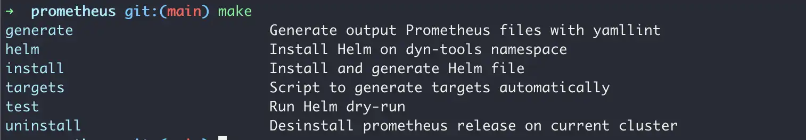

# Makefile : cibles, dépendances de fichiers et auto-documentation

On met un `Makefile` dans à peu près tous les repos, et 9 fois sur 10 c'est un lanceur de commandes déguisé : une liste de cibles qui appellent chacune un `docker build` ou un `kubectl apply`. Ça marche très bien, mais on paye la syntaxe de `make` sans utiliser ce qui la justifie.

## À quoi ça sert, vraiment

`make` n'est pas un task runner, c'est un moteur de dépendances qui compare des dates de modification. On lui déclare qu'un fichier `B` dépend d'un fichier `A`, et il ne reconstruit `B` que si `A` est plus récent. Tout le reste en découle.

L'usage en task runner est un détournement, et un détournement légitime : la syntaxe est partout, `make deploy` se devine sans lire la doc, et il n'y a rien à installer. Mais dès qu'une étape est lente et idempotente, par exemple un `terraform init` ou une installation de dépendances, le moteur de dépendances devient l'argument principal.

## La syntaxe qui pique

3 règles expliquent la quasi-totalité des messages d'erreur incompréhensibles de `make` :

- **l'indentation d'une recette est une tabulation**, pas des espaces. Un `Makefile:4: *** missing separator. Stop.` veut toujours dire ça.
- **chaque ligne d'une recette tourne dans son propre shell**. Un `cd build` sur une ligne n'a plus aucun effet sur la suivante.
- **une cible est un nom de fichier** par défaut. Si un fichier `test` existe dans le repo, `make test` répond `make: 'test' is up to date` et ne fait rien.

La troisième est ce que `.PHONY` corrige : elle déclare qu'une cible ne produit pas de fichier du même nom.

```Makefile
.PHONY: build test deploy clean

build:
    docker build -t myapp:dev .

test:
    go test ./...
```

!!! warning "Les blocs de cet article utilisent des espaces pour la lisibilité"
    Dans un vrai `Makefile`, chaque ligne de recette doit commencer par une tabulation. Un copier-coller depuis une page web récupère souvent des espaces, d'où le `missing separator` immédiat.

## Les 4 affectations, et laquelle utiliser

C'est la source de bug la plus discrète du format, parce que les 4 se ressemblent et ne s'évaluent pas au même moment.

| Forme | Nom | Évaluation |
|---|---|---|
| `VAR = valeur` | récursive | à chaque utilisation |
| `VAR := valeur` | immédiate | une fois, à la lecture du fichier |
| `VAR ?= valeur` | conditionnelle | seulement si `VAR` n'est pas déjà définie |
| `VAR += valeur` | ajout | concatène à l'existant |

```Makefile
# Évalué une seule fois, c'est ce qu'on veut pour un appel de commande
GIT_SHA := $(shell git rev-parse --short HEAD)

# Surchargeable depuis l'environnement ou la ligne de commande
REGISTRY ?= europe-west9-docker.pkg.dev/myproject/apps
TAG      ?= $(GIT_SHA)

IMAGE := $(REGISTRY)/myapp:$(TAG)
```

La règle pratique : `:=` par défaut, `?=` pour tout ce qu'on veut pouvoir surcharger, et `=` seulement quand la valeur doit être recalculée à chaque appel. Écrire `GIT_SHA = $(shell git rev-parse --short HEAD)` avec un simple `=` relance un `git rev-parse` à chaque fois que la variable apparaît, ce qui se voit sur un Makefile bavard.

Une variable posée en ligne de commande gagne sur celle du fichier, sauf si on utilise `override` :

```bash
make deploy TAG=v1.2.3 REGISTRY=docker.io/org
```

## Rendre les recettes strictes

Par défaut, `make` appelle `/bin/sh` sans aucun garde-fou : un pipe qui échoue au milieu passe pour un succès, et une variable non définie devient une chaîne vide. Sur un Makefile qui déploie, c'est le genre de silence qu'on ne veut pas.

```Makefile
SHELL := /usr/bin/env bash
.SHELLFLAGS := -euo pipefail -c
.ONESHELL:
.DELETE_ON_ERROR:
```

Ce que chaque ligne apporte :

- `SHELL` et `.SHELLFLAGS` donnent à chaque recette le même contrat qu'un script défensif : sortie sur erreur, sur variable non définie, et propagation de l'échec dans un pipe
- `.ONESHELL` exécute toute la recette dans un seul shell, donc un `cd` tient sur les lignes suivantes et on arrête d'écrire des `&& \` en fin de ligne
- `.DELETE_ON_ERROR` supprime le fichier produit quand la recette échoue, sinon `make` le considère à jour au prochain appel et saute l'étape

Ces 4 lignes en tête de fichier changent plus la fiabilité d'un Makefile que n'importe quelle astuce de syntaxe.

## Ne refaire que ce qui a changé

C'est là que `make` gagne contre un script shell. On déclare une cible qui est un vrai fichier, et l'étape est sautée tant que ses sources n'ont pas bougé.

```Makefile
# Le binaire dépend des sources : pas de rebuild si rien n'a changé
bin/myapp: $(shell find . -name '*.go') go.mod go.sum
    go build -o $@ ./cmd/myapp

# terraform init est lent : on pose un fichier témoin
.terraform/.init: main.tf versions.tf
    terraform init -upgrade
    @touch $@

plan: .terraform/.init
    terraform plan -out tfplan.binary
```

Le `$@` est le nom de la cible en cours, `$<` la première dépendance et `$^` toutes les dépendances. Le fichier témoin, souvent appelé fichier sentinelle, est le motif à connaître : quand une commande ne produit pas de fichier identifiable, on en crée un à la main avec `touch` pour donner à `make` une date à comparer.

Sur un `terraform init` de 40 secondes appelé 15 fois par jour, le gain est immédiat.

## Auto-documenter les cibles

Avec un peu de malice, rien de plus simple :

```Makefile
.DEFAULT_GOAL := help

help:
    @grep -E '^[a-zA-Z_-]+:.*?## .*$$' $(MAKEFILE_LIST) | sort | awk 'BEGIN {FS = ":.*?## "}; {printf "\033[36m%-30s\033[0m %s\n", $$1, $$2}'
```

Pour vous décripter ce que fait cette ligne automagique, tout d'abord, nous allons appliquer un grep sur les lignes commencant par une (ou plusieurs) lettre(s) suivi d'un `:`. Nous allons prendre tout le contenu qui suit les signes `##`. Une fois cela fait, nous allons le strier, puis appliquer un filtre pour les afficher de manière élégante.

Tout ceci pour nous donner le résultat suivant :



Le `.DEFAULT_GOAL := help` est la moitié utile du motif : un `make` sans argument affiche l'aide au lieu de lancer la première cible du fichier, ce qui évite le `make` qui déploie en prod par accident.

Les cibles se documentent ensuite avec un commentaire `##` sur la ligne de déclaration :

```Makefile
build: ## Construire l'image Docker locale
    docker build -t $(IMAGE) .

deploy: build ## Pousser l'image et appliquer le manifest
    docker push $(IMAGE)
    kubectl set image deployment/myapp myapp=$(IMAGE)
```

## Les pièges

- **`.PHONY` oublié sur une cible dont un fichier porte le nom.** Le symptôme est un `make` qui ne fait rien et annonce `up to date`. On déclare toutes les cibles non-fichier en une ligne en tête de Makefile.
- **`make -j` sans dépendances déclarées.** Le parallélisme suit le graphe : sans dépendance entre 2 cibles, `make -j4` les lance en même temps, y compris quand l'une avait besoin de l'autre. Le bug est intermittent, donc pénible.
- **La récursion avec `make` au lieu de `$(MAKE)`.** Seul `$(MAKE)` transmet les flags du parent, notamment `-j` et `-n`. Un `make -C sous-repo` écrit en dur casse le dry-run et le parallélisme.
- **Les variables d'environnement qui traversent.** Tout l'environnement du shell est visible dans le Makefile, donc une variable `TAG` déjà exportée dans le shell surcharge un `TAG ?=` sans prévenir. Sur les noms génériques, préfixer (`APP_TAG`) évite la collision.
- **`@` devant chaque ligne par réflexe.** Le `@` masque la commande affichée. C'est bien pour un `echo`, c'est une mauvaise idée sur une commande qui déploie : quand ça casse en CI, on veut voir la commande exacte dans les logs.

## Voir aussi

- [Écrire des scripts bash défensifs](../../linux/shell/write_bash_scripts.md) - le `set -euo pipefail` que reprend `.SHELLFLAGS`
- [Template de script bash](../../linux/shell/template_bash_script.md) - quand le Makefile ne suffit plus
- [Accélerer Terraform](../terraform/speedup.md) - les cibles Terraform qui gagnent à être cachées
