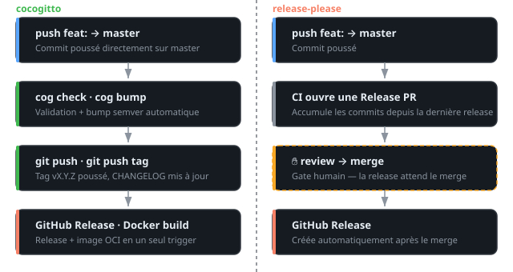

# Releases automatiques avec cocogitto

Cocogitto valide les conventional commits, bumpe le semver automatiquement et génère un CHANGELOG. Tout se déclenche sur `git push` vers master, sans PR intermédiaire.

## Cocogitto vs release-please

Les deux outils s'appuient sur les [Conventional Commits](https://www.conventionalcommits.org/) et automatisent le versioning. Ils ont des philosophies opposées.

| | cocogitto | release-please |
|---|---|---|
| **Déclencheur** | Push direct sur master | Merge d'une Release PR |
| **Validation locale** | `cog check`, hook pre-commit | Aucune |
| **Bump** | Immédiat au push | À la merge de la PR |
| **CHANGELOG** | Format cog (`- - -`) | Keep a Changelog |
| **GitHub Release** | `gh release create` à ajouter | Créée automatiquement |
| **Config** | `cog.toml` | `release-please-config.json` |
| **Mainteneur** | Communauté | Google |

En pratique, les deux flows divergent dès le premier push :



Release-please accumule les commits dans une PR ; la release n'a lieu que si quelqu'un merge manuellement, c'est un gate humain intégré. Cocogitto bumpe au push : zéro friction, mais zéro gate, il faut de la discipline sur les branches.

!!! warning "Bumps à répétition"
    Pousser plusieurs commits `fix:` directement sur master = autant de patch bumps. Travailler sur une branche feature et merger en une fois produit un seul bump.

## Installation

```bash
# macOS
brew install cocogitto

# Linux (binaire direct)
curl -L https://github.com/cocogitto/cocogitto/releases/latest/download/cocogitto-x86_64-unknown-linux-musl.tar.gz \
  | tar xz -C ~/.local/bin
```

## Configuration

```toml title="cog.toml"
ignore_merge_commits = true
tag_prefix = "v"          # obligatoire si vos tags existants sont en v*

[commit_types]
# Types custom pour le changelog
refacto = { changelog_title = "Refactoring" }
# perf ne bumpe pas par défaut - voir « Logique de bump »
perf = { changelog_title = "Performance Improvements", bump_patch = true }

[changelog]
path = "CHANGELOG.md"
template = "remote"
remote = "github.com"
repository = "mon-repo"
owner = "mon-org"
authors = []
```

!!! note "tag_prefix"
    Sans `tag_prefix = "v"`, cocogitto cherche des tags `1.2.3` (sans `v`). Si vos tags existants sont `v1.2.3` (format release-please, goreleaser…), ce champ est obligatoire.

## CHANGELOG.md

Cocogitto requiert un séparateur `- - -` pour savoir où insérer chaque nouvelle section. Le fichier minimal :

```markdown
# Changelog

- - -
```

À chaque bump, cog insère le nouveau bloc entre le header et le `- - -` précédent :

```markdown
# Changelog

- - -
## [v1.3.0](https://github.com/...) - 2026-05-11
#### Features
- (**api**) add pagination endpoint - ([abc1234](...)) - John Doe

- - -
## [v1.2.0](https://github.com/...) - 2026-05-01
...
```

!!! warning "Migration depuis release-please"
    Le CHANGELOG généré par release-please n'a pas de `- - -`. Il faut en ajouter un manuellement avant le premier `cog bump` sinon l'erreur `cannot find default separator` bloque le CI.

## Validation locale

```bash
# Valider tous les commits depuis le dernier tag
cog check

# Valider uniquement depuis le dernier tag (plus rapide)
cog check --from-latest-tag

# Voir ce que le prochain bump produirait
cog bump --auto --dry-run

# Bumper manuellement
cog bump --patch   # 1.2.3 → 1.2.4
cog bump --minor   # 1.2.3 → 1.3.0
cog bump --major   # 1.2.3 → 2.0.0
```

## Hook pre-commit

Cog peut valider le message de commit avant qu'il soit enregistré :

```yaml title=".pre-commit-config.yaml"
repos:
  - repo: local
    hooks:
      - id: cog-verify
        name: Conventional commit check
        language: system
        entry: cog verify
        stages: [commit-msg]
        args: ["--file", ".git/COMMIT_EDITMSG"]
```

## GitHub Actions

<!-- markdownlint-disable MD046 -->
??? example ".github/workflows/release.yml"
    ```yaml
    name: Release

    on:
      push:
        branches: [master]

    permissions:
      contents: write
      packages: write

    jobs:
      release:
        runs-on: ubuntu-latest
        outputs:
          bumped: ${{ steps.bump.outputs.bumped }}
          tag_name: ${{ steps.bump.outputs.tag_name }}
        steps:
          - uses: actions/checkout@v7
            with:
              fetch-depth: 0          # obligatoire : cog a besoin de tout l'historique
              token: ${{ secrets.GITHUB_TOKEN }}

          - uses: cocogitto/cocogitto-action@v4
            with:
              git-user: github-actions[bot]
              git-user-email: github-actions[bot]@users.noreply.github.com
              command: check
              args: --from-latest-tag   # ne valide que les commits depuis le dernier tag

          - name: Bump version
            id: bump
            run: |
              BEFORE=$(git describe --tags --abbrev=0 2>/dev/null || echo "")
              cog bump --auto || true
              AFTER=$(git describe --tags --abbrev=0 2>/dev/null || echo "")
              if [ "$BEFORE" != "$AFTER" ]; then
                git push
                git push origin "$AFTER"
                echo "bumped=true" >> "$GITHUB_OUTPUT"
                echo "tag_name=$AFTER" >> "$GITHUB_OUTPUT"
              else
                echo "bumped=false" >> "$GITHUB_OUTPUT"
              fi

          - name: Create GitHub release
            if: steps.bump.outputs.bumped == 'true'
            env:
              GH_TOKEN: ${{ secrets.GITHUB_TOKEN }}
            run: |
              TAG="${{ steps.bump.outputs.tag_name }}"
              NOTES=$(awk "/^## .*${TAG#v}/{found=1; next} found && /^- - -/{exit} found{print}" CHANGELOG.md)
              gh release create "$TAG" \
                --title "$TAG" \
                --notes "${NOTES:-Release $TAG}" \
                --verify-tag

      build-push:
        needs: release
        if: needs.release.outputs.bumped == 'true'
        runs-on: ubuntu-latest
        steps:
          - uses: actions/checkout@v7
            with:
              ref: ${{ needs.release.outputs.tag_name }}

          - uses: docker/setup-buildx-action@v4

          - uses: docker/login-action@v4
            with:
              registry: ghcr.io
              username: ${{ github.actor }}
              password: ${{ secrets.GITHUB_TOKEN }}

          - uses: docker/metadata-action@v6
            id: meta
            with:
              images: ghcr.io/${{ github.repository }}
              tags: |
                type=semver,pattern={{version}},value=${{ needs.release.outputs.tag_name }}
                type=semver,pattern={{major}}.{{minor}},value=${{ needs.release.outputs.tag_name }}
                type=raw,value=latest   # non généré automatiquement hors push de tag natif
                type=sha,prefix=sha-

          - uses: docker/build-push-action@v7
            with:
              push: true
              platforms: linux/amd64,linux/arm64
              cache-from: type=gha
              cache-to: type=gha,mode=max
              tags: ${{ steps.meta.outputs.tags }}
              labels: ${{ steps.meta.outputs.labels }}

    ```
<!-- markdownlint-enable MD046 -->

<!-- markdownlint-disable MD046 -->
!!! warning "cocogitto-action : nom du dépôt et migration v3 → v4"
    L'action vit sous `cocogitto/cocogitto-action`. Les exemples qui traînent en
    ligne référencent souvent `oknozor/cocogitto-action` : c'est le même dépôt,
    transféré du compte personnel du mainteneur vers l'organisation et ça ne
    fonctionne que par la redirection GitHub. Autant pointer le nom canonique.

    La **v4 est cassante** et l'échec est silencieux au moment du bump :

    | v3 | v4 |
    |---|---|
    | `check: true` (défaut) | `command: check` - **obligatoire** |
    | `check-latest-tag-only: true` | `args: --from-latest-tag` |
    | `release: true` | `command: bump` + `args` |

    Un input inconnu ne fait qu'un warning côté Actions, mais `command` manquant
    fait sortir le script en erreur : `Error: No command specified`. Le job release
    échoue à chaque push sur master.

    v4 embarque aussi cog 6.4.0 au lieu de 6.3.0 - à garder en tête si un
    comportement de bump change.
<!-- markdownlint-enable MD046 -->

!!! note "tag latest non automatique"
    `docker/metadata-action` ne génère `latest` automatiquement que sur un push de tag GitHub (`on: push: tags: ['v*']`). Ici le trigger est un push de branche, donc il faut `type=raw,value=latest` explicitement.

## Logique de bump

| Commit | Bump |
|--------|------|
| `fix:` | patch (`1.2.3 → 1.2.4`) |
| `feat:` | minor (`1.2.3 → 1.3.0`) |
| `feat!:` ou `BREAKING CHANGE` | major (`1.2.3 → 2.0.0`) |
| `perf:`, `refactor:` | aucun bump (configurable, voir ci-dessous) |
| `chore:`, `docs:`, `ci:` | aucun bump (configurable, voir ci-dessous) |

<!-- markdownlint-disable MD046 -->
!!! warning "`perf:` ne déclenche aucune release"
    Seuls `feat` et `fix` bumpent par défaut. Une PR ne contenant que des commits
    `perf:` produit un job de release **vert** mais sans tag :

    ```text
    No conventional commits for your repository that required a bump.
    ```

    Le piège est que tout a l'air de fonctionner : `release` passe en success, et
    ce sont les jobs conditionnés par `bumped == 'true'` (build Docker, publication
    Helm) qui sont *skipped*. L'optimisation reste sur master et ne sortira qu'au
    prochain `fix:` sans rapport, qui l'embarquera au passage.
<!-- markdownlint-enable MD046 -->

Pour qu'un type déclenche un bump, `[commit_types]` accepte `bump_patch` et `bump_minor` :

```toml title="cog.toml"
[commit_types]
perf = { changelog_title = "Performance Improvements", bump_patch = true }
```

Un type que cocogitto connaît déjà garde son titre de section même sans le redéclarer :
en 7.0.0, un `chore = { bump_patch = true }` sort toujours sous « Miscellaneous Chores ».
Pour un type inventé maison il n'y a aucun défaut à conserver et `changelog_title` est
ce qui lui donne une section plutôt que de le laisser hors du CHANGELOG.

Le type qu'on finit par vouloir bumper n'est d'ailleurs pas `perf:` mais `chore:`.
Renovate et Dependabot rangent sous ce type tout ce qui n'est pas une dépendance de
production. Le piège est exactement celui de l'optimisation : le bump atterrit sur
master, aucun tag ne sort et la dépendance corrigée n'est jamais reconstruite si l'image
et le chart sont conditionnés à `bumped == 'true'`. Elle est à jour dans le lockfile et
absente de ce qui tourne.

```toml title="cog.toml"
[commit_types]
chore = { bump_patch = true }
```

`bump_patch` plutôt que `bump_minor`. Ce n'est pas une question de goût. Un bot qui
vérifie tous les jours produit plusieurs merges par semaine : en minor le numéro atteint
la v1.15.0 en un mois sans qu'une seule fonctionnalité soit sortie et le minor ne veut
plus rien dire le jour où une vraie feature arrive. En patch la version reste lisible et
dit ce qu'elle est, du contenu qui bouge sans surface nouvelle.

!!! warning "La règle vaut pour tous les `chore:`"
    `[commit_types]` est indexé par type, pas par scope : le réglage s'applique à
    `chore(docs)` comme à `chore(deps)`. Un simple rangement de documentation coupera
    lui aussi une release, avec son image et son chart.

!!! tip "Vérifier avant de pousser"
    `cog bump --auto --dry-run` répond `No conventional commits...` ou la version
    calculée. C'est la façon la plus rapide de confirmer qu'un changement de
    `[commit_types]` produit bien l'effet attendu. Attention, `cog bump` refuse de
    tourner sur un arbre de travail sale : il affiche un `git status` au lieu du
    résultat. Committer d'abord.

## Quand choisir quoi

**Cocogitto** si :

- Projet solo ou petite équipe, merge direct sur main
- Tu veux valider les commits localement avant push
- Tu veux des releases immédiates sans étape manuelle

**release-please** si :

- Équipe avec review obligatoire avant release
- Tu veux un gate humain explicite sur chaque release
- Tu travailles déjà avec les PR GitHub comme unité de travail

## Voir aussi

- [GoReleaser](goreleaser.md) - construire et publier les artefacts que cocogitto vient de tagger
- [CI Go sur GitHub Actions](go-ci.md) - les jobs qui doivent passer avant qu'un bump ait un sens
- [Hardening des workflows GitHub Actions](hardening.md) - protéger le token qui pousse le tag et la release
- [Valider une config Renovate](renovate-config.md) - garder les commits automerge conformes à la convention
