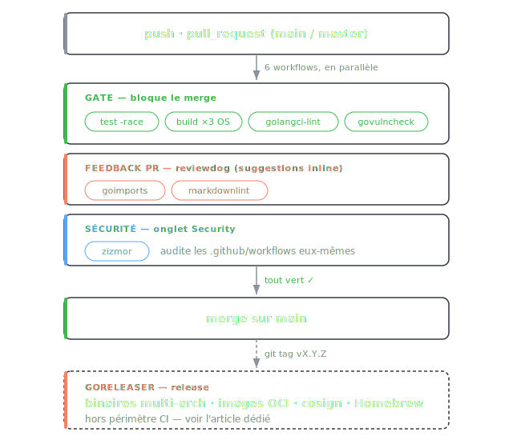

# CI GitHub Actions durcie pour un projet Go

Une CI Go, ce n'est pas juste `go test`. Test multi-plateforme, lint, scan de vulnérabilités, et surtout un durcissement contre les attaques supply-chain sur les workflows eux-mêmes. Tout ce qui suit tourne sur `push` et `pull_request`, mesuré sur un vrai repo public : [gopen](https://github.com/PixiBixi/gopen).

## Flow



## Vue d'ensemble

Six workflows, un rôle par fichier. Le release (GoReleaser) est traité à part, voir [l'article dédié](goreleaser.md).

| Workflow | Rôle | Déclencheur |
|----------|------|-------------|
| `ci.yml` | `go mod verify`, `go test -race`, build matrice ubuntu/macos/windows | push, PR |
| `lint.yml` | golangci-lint v2 | push, PR |
| `govulncheck.yml` | CVE sur les dépendances et la toolchain | push, PR |
| `go-format.yml` | goimports, suggestions inline en PR | push, PR |
| `markdownlint.yml` | remark-lint sur les `.md`, suggestions inline | push, PR |
| `github-actions.yml` | zizmor, audit des workflows eux-mêmes | push, PR |

## Le socle de durcissement

C'est ce qui distingue une CI correcte d'une CI qu'on peut laisser tourner sur un repo public sans y penser. Quatre patterns, appliqués sur **tous** les workflows.

### Épingler les actions par SHA, pas par tag

Un tag Git est mutable. `uses: actions/checkout@v7` pointe vers ce que le mainteneur (ou quelqu'un qui a compromis son compte) décide d'y mettre. Le SHA d'un commit, lui, ne bouge pas.

```yaml
# Fragile : le tag peut être redéplacé sur du code malveillant
- uses: actions/checkout@v7

# Durci : le SHA est immuable, le commentaire garde la version lisible
- uses: actions/checkout@9c091bb21b7c1c1d1991bb908d89e4e9dddfe3e0 # v7.0.0
```

Le commentaire `# v7.0.0` n'est pas décoratif : [Renovate](https://docs.renovatebot.com/) le lit pour bumper le SHA **et** mettre à jour le commentaire, ce qui garde le pinning sans figer les actions dans le passé. Sur `gopen`, les updates d'actions sont même groupées et automergées :

```json title="renovate.json"
{
  "matchManagers": ["github-actions"],
  "groupName": "github-actions",
  "automerge": true,
  "automergeType": "pr"
}
```

### Permissions au moindre privilège

Le `GITHUB_TOKEN` par défaut est trop permissif. On le réduit au strict nécessaire, par workflow, et on descend au niveau du job quand un seul job a besoin d'un droit en écriture.

```yaml
# Aucun droit : le workflow zizmor n'écrit rien au niveau global...
permissions: {}

jobs:
  zizmor:
    permissions:
      security-events: write   # ...sauf ce job, pour publier dans l'onglet Security
```

L'échelle qu'on retrouve dans le repo :

| Besoin | `permissions` |
|--------|---------------|
| Lecture seule (test, lint, govulncheck) | `contents: read` |
| Commenter/suggérer en PR (reviewdog) | `contents: read` + `pull-requests: write` |
| Rien au global, un droit scopé par job | `{}` puis override dans le job |

### Couper les credentials sur le checkout

Par défaut, `actions/checkout` laisse le token traîner dans la config Git du runner. Un script de build compromis peut le récupérer et pousser sur le repo. On le désactive partout :

```yaml
- uses: actions/checkout@9c091bb21b7c1c1d1991bb908d89e4e9dddfe3e0 # v7.0.0
  with:
    persist-credentials: false
```

### zizmor : le linter de tes workflows

Les trois patterns ci-dessus, il faut les tenir sur la durée. [zizmor](https://github.com/zizmorcore/zizmor) audite les fichiers `.github/workflows/` et flague les tags non épinglés, les permissions trop larges, les injections de template, les credentials persistés. Un workflow qui s'auto-surveille :

```yaml title=".github/workflows/github-actions.yml"
name: github-actions

on:
  push:
    branches: [main, master]
  pull_request:

permissions: {}

jobs:
  zizmor:
    name: Run zizmor
    runs-on: ubuntu-latest
    permissions:
      security-events: write
    steps:
      - uses: actions/checkout@9c091bb21b7c1c1d1991bb908d89e4e9dddfe3e0 # v7.0.0
        with:
          persist-credentials: false
      - uses: zizmorcore/zizmor-action@192e21d79ab29983730a13d1382995c2307fbcaa # v0.5.7
```

!!! tip "Faire tourner zizmor en local"
    `uvx zizmor .github/workflows/` (ou `pipx run zizmor`) donne le même verdict avant de committer.

## Test et build multi-plateforme

Deux jobs dans `ci.yml`. Le premier teste, le second vérifie que le binaire compile sur les trois OS.

```yaml title=".github/workflows/ci.yml"
jobs:
  test:
    runs-on: ubuntu-latest
    steps:
      - uses: actions/checkout@9c091bb21b7c1c1d1991bb908d89e4e9dddfe3e0 # v7.0.0
        with:
          persist-credentials: false
      - uses: actions/setup-go@924ae3a1cded613372ab5595356fb5720e22ba16 # v6.5.0
        with:
          go-version-file: go.mod
      - run: go mod verify
      - run: go build -v ./...
      - run: go test -race ./...

  build:
    runs-on: ${{ matrix.os }}
    strategy:
      matrix:
        os: [ubuntu-latest, macos-latest, windows-latest]
    steps:
      - uses: actions/checkout@9c091bb21b7c1c1d1991bb908d89e4e9dddfe3e0 # v7.0.0
        with:
          persist-credentials: false
      - uses: actions/setup-go@924ae3a1cded613372ab5595356fb5720e22ba16 # v6.5.0
        with:
          go-version-file: go.mod
      - run: go build -v -o gopen${{ matrix.os == 'windows-latest' && '.exe' || '' }} .
```

Trois choix qui comptent :

- `go-version-file: go.mod` : la version de Go vient du `go.mod`, pas d'une valeur hardcodée qui dérive. Une seule source de vérité.
- `go test -race` : le détecteur de data races coûte un peu de temps CPU mais attrape des bugs de concurrence qu'aucun test classique ne voit.
- `go mod verify` : confirme que les modules téléchargés correspondent au hash du `go.sum` avant de compiler.

!!! note "Pourquoi séparer test et build ?"
    Le job `test` tourne une fois sur Linux (rapide, avec `-race`). Le job `build` vérifie juste la compilation cross-OS. Inutile de rejouer toute la suite de tests trois fois quand seul le build est OS-dépendant.

## Lint

golangci-lint agrège des dizaines de linters en un seul binaire, un seul passage. On épingle sa version pour que le CI soit reproductible : un nouveau linter activé par une mise à jour ne doit pas casser une PR sans qu'on l'ait décidé.

```yaml title=".github/workflows/lint.yml"
- uses: golangci/golangci-lint-action@ba0d7d2ec06a0ea1cb5fa41b2e4a3ab91d21278a # v9.3.0
  with:
    version: v2.12.2
```

La config vit dans `.golangci.yml`. Le principe : partir du set standard, ajouter ce qui apporte de la valeur, et **justifier chaque exclusion en commentaire** pour que le prochain qui lit comprenne pourquoi.

```yaml title=".golangci.yml"
version: "2"

linters:
  default: standard   # govet, staticcheck, errcheck, ineffassign, unused
  enable:
    - bodyclose        # response body non fermé = fuite de connexion
    - errorlint        # comparaisons d'erreurs cassées par le wrapping %w
    - forcetypeassert  # type assertion sans le ok, => panic potentiel
    - gosec            # scan sécurité
    - misspell
    - perfsprint       # fmt.Sprintf remplaçable par plus rapide
    - revive
  settings:
    gosec:
      excludes:
        - G204 # subprocess avec variable : gopen exec git/open sans shell,
        #        les args passent en argv séparés, pas d'injection possible
  exclusions:
    rules:
      # gosec sur les tests est bruyant (perms de fichiers) et hors runtime
      - path: _test\.go
        linters:
          - gosec
```

!!! warning "Ne pas désactiver un linter pour faire passer le CI"
    Une exclusion sans commentaire, c'est de la dette. Soit le linter a raison et on corrige, soit il a tort dans ce contexte précis et on écrit pourquoi. `G204` ci-dessus est un cas légitime : le binaire n'invoque jamais de shell.

## Vulnérabilités des dépendances

[govulncheck](https://go.dev/blog/govulncheck) est l'outil officiel de la Go Team. Sa force : il ne signale une CVE que si ton code **appelle réellement** la fonction vulnérable, pas juste parce que le module est dans l'arbre de dépendances. Beaucoup moins de faux positifs qu'un scanner générique.

```yaml title=".github/workflows/govulncheck.yml"
permissions:
  contents: read

jobs:
  govulncheck:
    runs-on: ubuntu-latest
    steps:
      - uses: golang/govulncheck-action@032d45514ae346b1db93c04b0c90b841c370344f # v1.1.0
        with:
          go-version-file: go.mod
```

Il couvre aussi les vulnérabilités de la toolchain Go elle-même, pas seulement les libs tierces.

## Feedback direct dans la PR

Faire échouer un job, c'est bien. Dire quoi corriger et où, c'est mieux. [reviewdog](https://github.com/reviewdog/reviewdog) poste les problèmes en suggestions inline sur la PR, applicables en un clic.

```yaml title=".github/workflows/go-format.yml"
permissions:
  contents: read
  pull-requests: write   # requis pour poster les suggestions

jobs:
  goimports:
    runs-on: ubuntu-latest
    steps:
      - uses: actions/checkout@9c091bb21b7c1c1d1991bb908d89e4e9dddfe3e0 # v7.0.0
        with:
          persist-credentials: false
      - uses: actions/setup-go@924ae3a1cded613372ab5595356fb5720e22ba16 # v6.5.0
        with:
          go-version-file: go.mod
      - run: go install golang.org/x/tools/cmd/goimports@latest
      - run: goimports -w $(find . -name '*.go')
      - uses: reviewdog/action-suggester@2558ba17e65a9039e73764a73009fc05fef28a46 # v1.24.3
        with:
          tool_name: goimports
```

Le job reformate le code, puis reviewdog compare avec ce qui a été poussé et propose le diff en commentaire. Même mécanique pour le Markdown avec `reviewdog/action-markdownlint` et `reporter: github-pr-review`.

## Récap

Ce qui fait la différence entre une CI Go qui marche et une CI Go qu'on laisse tourner sans y penser :

- Actions épinglées par SHA, versions gardées lisibles en commentaire
- `permissions:` au moindre privilège, par workflow et par job
- `persist-credentials: false` sur chaque checkout
- zizmor pour que tout ça reste vrai dans le temps
- `go test -race` et build sur les trois OS
- golangci-lint épinglé, exclusions justifiées
- govulncheck pour les CVE réellement atteignables
- reviewdog pour un feedback actionnable en PR

!!! tip "Et après le CI ?"
    Une fois le CI vert et un tag poussé, c'est [GoReleaser](goreleaser.md) qui prend le relais : binaires multi-arch, images OCI, signatures cosign, publication Homebrew.
