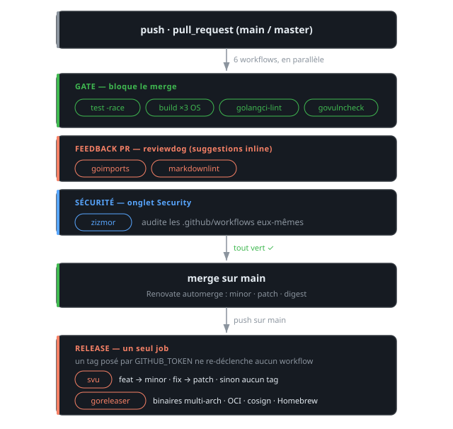

# CI GitHub Actions pour un projet Go

Une CI Go demande plus que `go test`. Test multi-plateforme, lint, scan de vulnérabilités et une release qui se déclenche toute seule sur le type de commit. Tout ce qui suit tourne sur `push` et `pull_request`, mesuré sur un vrai repo public : [gopen](https://github.com/PixiBixi/gopen).

!!! tip "Le socle de durcissement est traité à part"
    Épinglage par SHA, `permissions:`, `persist-credentials`, injection de template, zizmor et actionlint ne dépendent pas du langage et vivent dans [Durcir une CI GitHub Actions](hardening.md). Tous les workflows ci-dessous les appliquent.

## Flow



## Vue d'ensemble

6 workflows, un rôle par fichier. Le release (GoReleaser) est traité à part, voir [l'article dédié](goreleaser.md).

| Workflow | Rôle | Déclencheur |
|----------|------|-------------|
| `ci.yml` | `go mod verify`, `go test -race`, build matrice ubuntu/macos/windows | push, PR |
| `lint.yml` | golangci-lint v2 | push, PR |
| `govulncheck.yml` | CVE sur les dépendances et la toolchain | push, PR |
| `go-format.yml` | goimports, suggestions inline en PR | push, PR |
| `markdownlint.yml` | remark-lint sur les `.md`, suggestions inline | push, PR |
| `github-actions.yml` | zizmor, audit des workflows eux-mêmes | push, PR |

## Test et build multi-plateforme

2 jobs dans `ci.yml`. Le premier teste, le second vérifie que le binaire compile sur les 3 OS.

```yaml title=".github/workflows/ci.yml"
jobs:
  test:
    runs-on: ubuntu-24.04
    steps:
      - uses: actions/checkout@3d3c42e5aac5ba805825da76410c181273ba90b1 # v7.0.1
        with:
          persist-credentials: false
      - uses: actions/setup-go@b7ad1dad31e06c5925ef5d2fc7ad053ef454303e # v7.0.0
        with:
          go-version-file: go.mod
      - run: go mod verify
      - run: go build -v ./...
      - run: go test -race ./...

  build:
    runs-on: ${{ matrix.os }}
    strategy:
      matrix:
        os: [ubuntu-24.04, macos-26, windows-2025]
    steps:
      - uses: actions/checkout@3d3c42e5aac5ba805825da76410c181273ba90b1 # v7.0.1
        with:
          persist-credentials: false
      - uses: actions/setup-go@b7ad1dad31e06c5925ef5d2fc7ad053ef454303e # v7.0.0
        with:
          go-version-file: go.mod
      - run: go build -v -o gopen${{ matrix.os == 'windows-2025' && '.exe' || '' }} .
```

3 choix qui comptent :

- `go-version-file: go.mod` : la version de Go vient du `go.mod`, pas d'une valeur hardcodée qui dérive. Une seule source de vérité.
- `go test -race` : le détecteur de data races coûte un peu de temps CPU mais attrape des bugs de concurrence qu'aucun test classique ne voit.
- `go mod verify` : confirme que les modules téléchargés correspondent au hash du `go.sum` avant de compiler.

!!! note "Pourquoi séparer test et build ?"
    Le job `test` tourne une fois sur Linux (rapide, avec `-race`). Le job `build` vérifie juste la compilation cross-OS. Inutile de rejouer toute la suite de tests trois fois quand seul le build est OS-dépendant.

## Lint

golangci-lint agrège des dizaines de linters en un seul binaire, un seul passage. On épingle sa version pour que le CI soit reproductible : un nouveau linter activé par une mise à jour ne doit pas casser une PR sans qu'on l'ait décidé.

```yaml title=".github/workflows/lint.yml"
- uses: golangci/golangci-lint-action@ba0d7d2ec06a0ea1cb5fa41b2e4a3ab91d21278a # v9.3.0
  with:
    version: v2.12.2
```

La config vit dans `.golangci.yml`. Le principe : partir du set standard, ajouter ce qui apporte de la valeur et **justifier chaque exclusion en commentaire** pour que le prochain qui lit comprenne pourquoi.

```yaml title=".golangci.yml"
version: "2"

linters:
  default: standard   # govet, staticcheck, errcheck, ineffassign, unused
  enable:
    - bodyclose        # response body non fermé = fuite de connexion
    - errorlint        # comparaisons d'erreurs cassées par le wrapping %w
    - forcetypeassert  # type assertion sans le ok, => panic potentiel
    - gosec            # scan sécurité
    - misspell
    - perfsprint       # fmt.Sprintf remplaçable par plus rapide
    - revive
  settings:
    gosec:
      excludes:
        - G204 # subprocess avec variable : gopen exec git/open sans shell,
        #        les args passent en argv séparés, pas d'injection possible
  exclusions:
    rules:
      # gosec sur les tests est bruyant (perms de fichiers) et hors runtime
      - path: _test\.go
        linters:
          - gosec
```

!!! warning "Ne pas désactiver un linter pour faire passer le CI"
    Une exclusion sans commentaire, c'est de la dette. Soit le linter a raison et on corrige, soit il a tort dans ce contexte précis et on écrit pourquoi. `G204` ci-dessus est un cas légitime : le binaire n'invoque jamais de shell.

### gocritic et les gros structs copiés

Le set standard ne dit rien des copies de structs. Sur un projet qui manipule des objets Kubernetes, ça compte : un `corev1.Pod` pèse **1192 octets**, un `Node` 768, un `Container` 408 - mesuré au `unsafe.Sizeof`. Un `for _, p := range pods` copie donc 1,2 ko par tour et un helper qui prend un `corev1.Pod` en paramètre le recopie à chaque appel.

Le tag `performance` de [gocritic](https://go-critic.com/) attrape exactement ça, via `rangeValCopy` et `hugeParam`. Il n'est pas activé par défaut :

```yaml title=".golangci.yml"
linters:
  enable:
    - gocritic
  settings:
    gocritic:
      enabled-tags:
        - performance
      settings:
        hugeParam:
          # Défaut 80 : flague aussi les structs de config qu'on passe
          # volontairement par valeur et qu'on copie une fois par process.
          # 256 garde le check braqué sur les objets d'API.
          sizeThreshold: 256
```

Le seuil est le réglage à ne pas laisser par défaut. À 80, le linter réclame aussi des pointeurs sur les structs de configuration qui traversent toutes les signatures : sur `klens`, un `Flags` de 104 octets et un `App` de 96. Or elles sont copiées une fois par exécution. Les passer en pointeur touchait 25 signatures pour zéro gain, en ouvrant au passage la porte à une mutation accidentelle de flags partagés.

Reste le plus intéressant : corriger les 30 sites trouvés sur [klens](https://github.com/PixiBixi/kubectl-klens) n'a **rien accéléré**. Mesuré sur un cluster de production de 6400 pods, 5 exécutions, médianes :

| Commande | Temps | RSS max |
|---|---|---|
| `privileged -A` | 3,59 s → 3,53 s | 354 → 356 MiB |
| `images -A` | 3,31 s → 3,59 s | 372 → 372 MiB |

Tout dans le bruit. Le calcul de départ, « 56 Mo recopiés par exécution », était juste et hors sujet : 56 Mo de `memcpy`, c'est quelques millisecondes face aux 3,4 s passées à attendre l'apiserver. Et ces copies vivent sur la pile puis sont réutilisées, donc elles n'apparaissent même pas dans le RSS de pointe, dominé par le graphe d'objets décodés.

Ce que le check apporte quand même : il empêche de réintroduire le motif là où il *coûterait* vraiment, dans une slice de `Pod` à durée de vie longue ou une boucle imbriquée.

!!! warning "Un finding de linter n'est pas un gain de perf"
    `hugeParam` et `rangeValCopy` disent qu'une copie existe, pas qu'elle coûte. Sur un binaire dont le temps part en attente réseau, la réponse est souvent « rien du tout ». On mesure avant d'annoncer un gain et quand le gain n'existe pas, le commit se type `chore`, pas `perf`.

### Le piège des findings masqués

Celui-là vaut pour tous les linters, pas seulement gocritic. Par défaut, golangci-lint **cache une partie de ce qu'il trouve** : 50 findings par linter et surtout 3 occurrences par message identique.

30 sites copiant chacun `1192 bytes` produisent 30 messages au texte identique, dont 3 s'affichent. On corrige les 3, on relance, 3 nouveaux apparaissent. Sur `klens`, le premier passage annonçait 25 problèmes : des fichiers entiers n'étaient jamais sortis et la correction paraissait finie alors qu'il en restait.

```yaml title=".golangci.yml"
issues:
  # Les défauts (50 par linter, 3 par message identique) masquent les répétitions :
  # un lot de findings au texte identique paraît réglé alors qu'il en reste.
  max-issues-per-linter: 0
  max-same-issues: 0
```

Sur un repo de taille raisonnable, il n'y a aucune raison de plafonner. Un linter qui ne montre pas tout est plus dangereux qu'un linter bruyant : on lui fait confiance à tort.

### La variante reviewdog

Il existe une seconde action, [reviewdog/action-golangci-lint](https://github.com/reviewdog/action-golangci-lint), qui poste les findings en commentaires de PR au lieu d'annotations. Tentant quand on utilise déjà reviewdog pour goimports. Sauf que ses défauts vont à l'envers de tout ce qui précède :

- `golangci_lint_version` et `reviewdog_version` valent `latest`, donc la version qui tourne change sans commit.
- `fail_level` vaut `none` et [le code de sortie de golangci-lint est ignoré](https://github.com/reviewdog/action-golangci-lint/blob/master/src/main.ts) dans le code de l'action : les sorties 0, 1 et 2 passent toutes. Le job est donc **vert avec des findings**, c'est reviewdog seul qui décide d'échouer.
- `filter_mode` vaut `added`, donc seules les lignes ajoutées sont remontées. Même famille de problème que `max-same-issues` : ce qu'on ne voit pas, on le croit corrigé.

Tout ça se règle (`fail_level: error`, `filter_mode: nofilter`, versions épinglées), mais il reste un plafond qu'on ne peut pas lever : sur une PR venant d'un fork, le `GITHUB_TOKEN` est en lecture seule, donc reviewdog [retombe sur les logging commands](https://github.com/reviewdog/reviewdog#graceful-degradation-for-pull-requests-from-forked-repositories), soit exactement les annotations que l'action officielle produit déjà. On garde donc l'officielle pour le gate et reviewdog là où il apporte vraiment autre chose : un diff applicable en un clic, ce que golangci-lint ne produit pas.

## Vulnérabilités des dépendances

[govulncheck](https://go.dev/blog/govulncheck) est l'outil officiel de la Go Team. Sa force : il ne signale une CVE que si le code **appelle réellement** la fonction vulnérable, pas juste parce que le module est dans l'arbre de dépendances. Beaucoup moins de faux positifs qu'un scanner générique.

```yaml title=".github/workflows/govulncheck.yml"
permissions:
  contents: read

jobs:
  govulncheck:
    runs-on: ubuntu-24.04
    steps:
      - uses: golang/govulncheck-action@032d45514ae346b1db93c04b0c90b841c370344f # v1.1.0
        with:
          go-version-file: go.mod
```

Il couvre aussi les vulnérabilités de la toolchain Go elle-même, pas seulement les libs tierces.

## Feedback direct dans la PR

Faire échouer un job, c'est bien. Dire quoi corriger et où, c'est mieux. [reviewdog](https://github.com/reviewdog/reviewdog) poste les problèmes en suggestions inline sur la PR, applicables en un clic. Rien de spécifique à Go là-dedans, il avale la sortie de n'importe quel linter - l'exemple ici est juste le workflow de formatage.

```yaml title=".github/workflows/go-format.yml"
permissions:
  contents: read
  pull-requests: write   # requis pour poster les suggestions

jobs:
  goimports:
    runs-on: ubuntu-24.04
    steps:
      - uses: actions/checkout@3d3c42e5aac5ba805825da76410c181273ba90b1 # v7.0.1
        with:
          persist-credentials: false
      - uses: actions/setup-go@b7ad1dad31e06c5925ef5d2fc7ad053ef454303e # v7.0.0
        with:
          go-version-file: go.mod
      - env:
          # renovate: datasource=go depName=golang.org/x/tools
          GOIMPORTS_VERSION: v0.48.0
        run: go install "golang.org/x/tools/cmd/goimports@${GOIMPORTS_VERSION}"
      - run: find . -name '*.go' -exec goimports -w {} +
      - uses: reviewdog/action-suggester@2558ba17e65a9039e73764a73009fc05fef28a46 # v1.24.3
        with:
          tool_name: goimports
```

Le job reformate le code, puis reviewdog compare avec ce qui a été poussé et propose le diff en commentaire. Même mécanique pour le Markdown avec `reviewdog/action-markdownlint` et `reporter: github-pr-review`.

Le `go install ... @latest` qu'on écrit par réflexe est le même problème qu'un tag d'action : la version installée change sans commit et un compte upstream compromis livre directement dans le job. Le proxy Go vérifie bien le checksum, mais d'une version qu'on n'a pas choisie, d'où le pin en variable d'env que Renovate suit via le commentaire `# renovate:`.

## Releases pilotées par les commits

Une CI fiable débloque un cran d'automatisation de plus : faire du type de commit le déclencheur d'une release et laisser Renovate merger ses PR tout seul. La partie automerge (et le cooldown qui la rend sûre) est dans [l'article durcissement](hardening.md#automerger-sans-avaler-une-release-compromise) ; ce qui suit est le maillon d'après, propre au repo Go. Pour la même mécanique sans Go ni GoReleaser, avec CHANGELOG généré et comparaison à release-please, voir [Cocogitto](cocogitto.md).

### Faire du commit le déclencheur de version

Le chaînon manquant : relier le contenu d'une PR mergée à un numéro de version. Les commits conventionnels le permettent - `feat` → bump mineur, `fix` → bump patch. Renovate sait taguer ses commits par type d'update, ce qui suffit à décider du bump :

```json title="renovate.json"
"packageRules": [
  {
    "matchManagers": ["gomod"],
    "matchUpdateTypes": ["minor"],
    "semanticCommitType": "feat"
  },
  {
    "matchManagers": ["gomod"],
    "matchUpdateTypes": ["patch", "digest"],
    "semanticCommitType": "fix"
  },
  {
    "matchManagers": ["github-actions"],
    "semanticCommitType": "chore"
  }
]
```

| Update | Manager | Commit émis | Release |
|--------|---------|-------------|---------|
| `minor` | gomod | `feat(deps):` | version mineure |
| `patch` / `digest` | gomod | `fix(deps):` | version patch |
| tout | github-actions | `chore(deps):` | aucune |

!!! note "Pourquoi les actions ne déclenchent pas de release"
    Un bump d'action CI ne change pas le binaire livré - il n'a aucune raison de produire une nouvelle version. On le garde en `chore` : mergé automatiquement, mais invisible pour le versioning. Chaque bump de module Go, lui, est compilé dans l'artefact et justifie une release.

### Le workflow : taguer puis publier, en un seul job

[`svu`](https://github.com/caarlos0/svu) lit les commits depuis le dernier tag et calcule le prochain `vX.Y.Z` ; un appel API pose le tag, GoReleaser enchaîne dans le même job. Le garde-fou est dans la comparaison : `svu next` renvoie **la version courante** quand rien ne justifie de release, donc `next == current` signifie « ne rien faire » - aucune release parasite sur un simple `docs:` ou `chore:`.

```yaml title=".github/workflows/release.yml"
on:
  push:
    branches: [main]
    tags: ['v*']   # échappatoire : un tag posé à la main publie aussi

permissions:
  contents: write

jobs:
  release:
    runs-on: ubuntu-24.04
    steps:
      - uses: actions/checkout@3d3c42e5aac5ba805825da76410c181273ba90b1 # v7.0.1
        with:
          fetch-depth: 0
          persist-credentials: false
      # setup-go d'abord : il sert à installer svu, puis à GoReleaser
      - uses: actions/setup-go@b7ad1dad31e06c5925ef5d2fc7ad053ef454303e # v7.0.0
        with:
          go-version-file: go.mod
          cache: false
      - id: tag
        if: github.ref_type == 'branch'
        env:
          GH_TOKEN: ${{ secrets.GITHUB_TOKEN }}
          # renovate: datasource=github-releases depName=caarlos0/svu
          SVU_VERSION: v3.4.1
        run: |
          set -euo pipefail
          GOBIN="${RUNNER_TEMP}/bin" go install "github.com/caarlos0/svu/v3@${SVU_VERSION}"
          svu="${RUNNER_TEMP}/bin/svu"

          current=$("$svu" current)
          next=$("$svu" next --v0)
          [ "$next" = "$current" ] && exit 0   # rien de releasable

          gh api "repos/${GITHUB_REPOSITORY}/git/refs" \
            -f "ref=refs/tags/${next}" -f "sha=${GITHUB_SHA}" --silent
          echo "new_tag=${next}" >> "$GITHUB_OUTPUT"
      - if: github.ref_type == 'tag' || steps.tag.outputs.new_tag != ''
        run: git fetch --tags --force
      # setup-go + GoReleaser, gardés par la même condition - voir l'article GoReleaser
```

`go install` passe par le proxy de modules Go, donc la version de svu est vérifiée contre la base de checksums - et le pin en variable d'env est suivi par Renovate via un `customManager` regex. Créer le tag par l'API plutôt qu'avec `git push` permet de garder `persist-credentials: false` sur le checkout.

!!! warning "`perf:` ne déclenche pas de release"
    svu applique la spec Conventional Commits à la lettre : seuls `fix` (patch) et `feat` (mineur) sont normatifs. Un `perf:` seul ne sort donc **aucune** version et sa config ne permet pas d'ajouter des mots-clés. Si un gain de perf doit être livré tout de suite, il se type `fix:`. Le flag `--v0` évite au passage qu'un breaking change fasse sauter un projet en `0.x` directement en `v1.0.0`.

<!-- markdownlint-disable MD046 -->
!!! note "Pourquoi pas une action toute faite ?"
    Le réflexe est d'utiliser `mathieudutour/github-tag-action`, la plus répandue pour ça. Elle est **abandonnée** : plus de release depuis mars 2024, plus de commit depuis juin 2024 et toujours `using: node20` - donc une alerte de dépréciation à chaque release, sans version vers laquelle migrer. Épingler par SHA protège d'un tag repointé, pas d'un projet mort.

    Les remplaçantes évidentes ne tiennent pas l'examen : `anothrNick/github-tag-action` ne fait **pas** de conventional commits (elle cherche des hashtags `#major`/`#minor`/`#patch` et détourner ses tokens donne un match de sous-chaîne où « prefix » déclenche un patch) ; `TriPSs/conventional-changelog-action` fonctionne mais écrit un `CHANGELOG.md` par défaut, ce qui salit l'arbre que GoReleaser va lire ; `release-please` et consorts imposent un modèle de release PR, soit exactement le clic humain que l'automerge cherche à supprimer.

    D'où le choix d'un CLI maintenu qui ne fait que le calcul, plus un appel API. Leçon générale : sur un chemin de release qui détient `contents: write`, la maintenance de la dépendance compte autant que ses fonctionnalités.
<!-- markdownlint-enable MD046 -->

Pourquoi tout dans un seul job, plutôt qu'un workflow qui tague et un autre qui publie sur le tag ? Parce qu'un tag poussé avec le `GITHUB_TOKEN` par défaut **ne re-déclenche pas** de workflow - garde-fou anti-boucle de GitHub. Séparer les 2 imposerait un PAT dédié juste pour ré-armer le second workflow. En enchaînant calcul-du-tag et publication dans le même run, on s'en passe. La double condition (`ref_type == 'tag'` ou nouveau tag calculé) préserve l'échappatoire manuelle : un `v*` poussé à la main court-circuite le calcul et publie directement.

Renovate merge un `minor` de dépendance, la CI passe, une version mineure sort et est publiée - sans qu'une main touche à un tag.

## Récap

Ce qui fait la différence entre une CI Go qui marche et une CI Go qu'on laisse tourner sans y penser :

- `go test -race` et build sur les 3 OS, version de Go lue dans le `go.mod`
- `go mod verify` avant de compiler
- golangci-lint épinglé, exclusions justifiées, `max-same-issues: 0` pour ne rien masquer
- gocritic sur le tag `performance`, avec un `sizeThreshold` qui vise les objets d'API
- govulncheck pour les CVE réellement atteignables
- reviewdog pour un feedback actionnable en PR et aucun outil installé en `@latest`
- Release calculée par svu depuis les commits conventionnels, dans le même job que GoReleaser
- Et par-dessus, le [socle de durcissement](hardening.md) commun à tous les workflows

!!! tip "Et après le CI ?"
    Une fois le CI vert et un tag posé, à la main ou calculé par la CI (voir plus haut), c'est [GoReleaser](goreleaser.md) qui prend le relais : binaires multi-arch, images OCI, signatures cosign, publication Homebrew.
