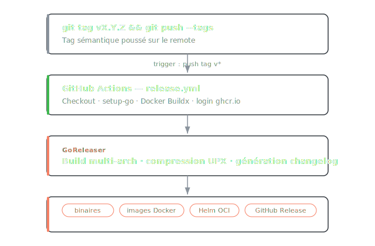

# Releases Go avec GoReleaser

GoReleaser génère changelog, binaires multi-arch, archives, images Docker et charts Helm à partir d'un seul fichier de config — le tout déclenché par un `git push --tags`.

## Flow



## Installation

```bash
# macOS
brew install goreleaser

# Linux (binaire direct)
curl -sfL https://goreleaser.com/static/run | bash
```

## Configuration de base

```yaml title=".goreleaser.yml"
version: 2

before:
  hooks:
    - go mod tidy
    - go mod verify

builds:
  - id: mon-binaire
    binary: mon-binaire
    env:
      - CGO_ENABLED=0
    goos:
      - linux
      - darwin
      - windows
    goarch:
      - amd64
      - arm64
    ignore:
      - goos: windows
        goarch: arm64
    flags:
      - -trimpath
    ldflags:
      - -s -w
      - -X main.version={{.Version}}
      - -X main.commit={{.Commit}}
      - -X main.date={{.Date}}

archives:
  - formats: [tar.gz]
    name_template: "{{ .ProjectName }}_{{ .Version }}_{{ .Os }}_{{ .Arch }}"
    format_overrides:
      - goos: windows
        formats: [zip]
    files:
      - README.md
      - LICENSE*

checksum:
  name_template: checksums.txt

release:
  draft: false
  prerelease: auto
```

## Réduire la taille des binaires

Trois flags suffisent pour gagner ~33% :

| Flag | Effet |
|------|-------|
| `-s` | Supprime la table des symboles |
| `-w` | Supprime les infos de debug DWARF |
| `-trimpath` | Supprime les chemins locaux embarqués dans le binaire |
| `CGO_ENABLED=0` | Désactive CGO → binaire statique pur |

Résultat sur un binaire typique : **3,0 Mo → 2,0 Mo**.

## Compression UPX (Linux uniquement)

UPX compresse l'exécutable — il s'auto-décompresse à l'exécution. Gain supplémentaire de 60-70%.

```yaml
upx:
  - enabled: true
    ids: [mon-binaire]
    compress: best
    lzma: true
    goos: [linux]
```

!!! warning "UPX et macOS/Windows"
    UPX est déconseillé sur macOS (problèmes de notarisation Apple) et Windows (faux positifs antivirus). Le limiter à `goos: [linux]`.

## Images Docker multi-arch

GoReleaser gère le build multi-arch via Docker Buildx et crée automatiquement le manifest combiné.

```yaml
dockers:
  - id: amd64
    goos: linux
    goarch: amd64
    image_templates:
      - "ghcr.io/monorg/mon-image:{{ .Tag }}-amd64"
    dockerfile: Dockerfile.release
    use: buildx
    build_flag_templates:
      - "--platform=linux/amd64"
      - "--label=org.opencontainers.image.version={{.Version}}"
      - "--label=org.opencontainers.image.source=https://github.com/monorg/mon-repo"

  - id: arm64
    goos: linux
    goarch: arm64
    image_templates:
      - "ghcr.io/monorg/mon-image:{{ .Tag }}-arm64"
    dockerfile: Dockerfile.release
    use: buildx
    build_flag_templates:
      - "--platform=linux/arm64"

docker_manifests:
  - name_template: "ghcr.io/monorg/mon-image:{{ .Tag }}"
    image_templates:
      - "ghcr.io/monorg/mon-image:{{ .Tag }}-amd64"
      - "ghcr.io/monorg/mon-image:{{ .Tag }}-arm64"

  - name_template: "ghcr.io/monorg/mon-image:latest"
    image_templates:
      - "ghcr.io/monorg/mon-image:{{ .Tag }}-amd64"
      - "ghcr.io/monorg/mon-image:{{ .Tag }}-arm64"
```

`Dockerfile.release` est généralement un Dockerfile minimal (`FROM scratch` ou `FROM gcr.io/distroless/static`) qui copie juste le binaire déjà compilé par GoReleaser.

## Helm chart vers OCI

GoReleaser ne gère pas nativement le push Helm, mais on l'ajoute en step post-GoReleaser dans le workflow :

```yaml
- name: Push Helm chart to OCI
  run: |
    CHART_VERSION="${GITHUB_REF_NAME#v}"
    helm registry login ghcr.io \
      --username "${{ github.repository_owner }}" \
      --password "${{ secrets.GITHUB_TOKEN }}"
    helm package charts/mon-chart \
      --version "$CHART_VERSION" \
      --app-version "$CHART_VERSION"
    helm push "mon-chart-${CHART_VERSION}.tgz" oci://ghcr.io/monorg/charts
```

## GitHub Actions

```yaml title=".github/workflows/release.yml"
name: Release

on:
  push:
    tags:
      - 'v*'

permissions:
  contents: write
  packages: write   # push vers ghcr.io

jobs:
  goreleaser:
    runs-on: ubuntu-latest
    steps:
      - uses: actions/checkout@v4
        with:
          fetch-depth: 0   # GoReleaser a besoin de l'historique complet pour le changelog

      - uses: actions/setup-go@v5
        with:
          go-version: stable

      - name: Set up Docker Buildx
        uses: docker/setup-buildx-action@v3

      - name: Login to GitHub Container Registry
        uses: docker/login-action@v3
        with:
          registry: ghcr.io
          username: ${{ github.repository_owner }}
          password: ${{ secrets.GITHUB_TOKEN }}

      - name: Run GoReleaser
        uses: goreleaser/goreleaser-action@v6
        with:
          version: '~> v2'
          args: release --clean
        env:
          GITHUB_TOKEN: ${{ secrets.GITHUB_TOKEN }}
```

!!! note "fetch-depth: 0"
    Sans `fetch-depth: 0`, GitHub Actions fait un clone superficiel. GoReleaser ne peut pas générer le changelog car il n'a pas accès aux commits précédents.

## Commandes utiles

```bash
# Valider la config sans déclencher de release
goreleaser check

# Tester localement (snapshot = pas de tag requis, pas de push)
goreleaser release --snapshot --clean

# Release manuelle (si pas de CI)
git tag -a v1.2.3 -m "Release v1.2.3"
git push origin v1.2.3
```

## Changelog

GoReleaser génère le changelog à partir des messages de commit entre deux tags. On peut filtrer et regrouper :

```yaml
changelog:
  sort: asc
  filters:
    exclude:
      - '^docs:'
      - '^test:'
      - '^chore:'
  groups:
    - title: Features
      regexp: '^feat:'
      order: 0
    - title: Bug Fixes
      regexp: '^fix:'
      order: 1
    - title: Performance
      regexp: '^perf:'
      order: 2
    - title: Others
      order: 999
```
