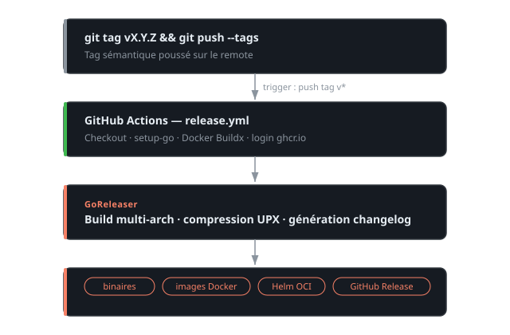

# Releases Go avec GoReleaser

GoReleaser génère changelog, binaires multi-arch, archives, images Docker et charts Helm depuis un fichier de config. Tout se déclenche sur `git push --tags`.

!!! tip "Avant le release, le CI"
    GoReleaser intervient une fois le tag poussé. Ce qui tourne *avant*, sur chaque push et PR (test, lint, scan de vulnérabilités, durcissement des workflows), est détaillé dans [CI GitHub Actions durcie pour un projet Go](go-ci.md).

## Flow



## Installation

```bash
# macOS
brew install goreleaser

# Linux (binaire direct)
curl -sfL https://goreleaser.com/static/run | bash
```

## Configuration de base

```yaml title=".goreleaser.yml"
version: 2

before:
  hooks:
    - go mod tidy
    - go mod verify

builds:
  - id: mon-binaire
    binary: mon-binaire
    main: .   # défauté par GoReleaser, mais ko lit la valeur brute (voir plus bas)
    env:
      - CGO_ENABLED=0
    goos:
      - linux
      - darwin
      - windows
    goarch:
      - amd64
      - arm64
    ignore:
      - goos: windows
        goarch: arm64
    flags:
      - -trimpath
    ldflags:
      - -s   # implique -w, voir plus bas
      - -X main.version={{.Version}}
      - -X main.commit={{.Commit}}
      - -X main.date={{.Date}}

archives:
  - formats: [tar.gz]
    name_template: "{{ .ProjectName }}_{{ .Version }}_{{ .Os }}_{{ .Arch }}"
    format_overrides:
      - goos: windows
        formats: [zip]
    files:
      - README.md
      - LICENSE*

checksum:
  name_template: checksums.txt

release:
  draft: false
  prerelease: auto
```

## Réduire la taille des binaires

3 flags suffisent pour gagner ~33% :

| Flag | Effet |
|------|-------|
| `-s` | Supprime la table des symboles, et le DWARF avec |
| `-trimpath` | Supprime les chemins locaux embarqués dans le binaire |
| `CGO_ENABLED=0` | Désactive CGO → binaire statique pur |

Résultat mesuré sur [gopen](https://github.com/PixiBixi/gopen) : **3,0 Mo → 2,0 Mo (-33%)**.

### `-s -w` : le `-w` ne sert à rien

On voit `-s -w` partout, dans la doc GoReleaser comme dans la moitié des projets Go. Le
`-w` est redondant : le linker le dérive de `-s` sauf s'il est passé explicitement.

```go title="$GOROOT/src/cmd/link/internal/ld/main.go:274"
*FlagW = *FlagS // -s implies -w if not explicitly set
```

Mesuré sur le contrôleur d'ingress HAProxy, `linux/amd64`, `-trimpath` sur les 4 builds :

| ldflags | Taille | `.symtab` | Sections `.debug*` |
|---|---|---|---|
| aucun | 103 276 329 o | oui | 8 |
| `-s` | 72 913 056 o | non | 0 |
| `-w` | 83 023 367 o | oui | 0 |
| `-s -w` | 72 913 056 o | non | 0 |

`-s` seul et `-s -w` sortent la même taille à l'octet près, avec les mêmes sections.
L'inverse n'est pas vrai : `-w` seul ne retire que le DWARF et garde la table des symboles,
soit 10 Mo de moins que `-s`. Écrire `-s` seul dit exactement ce qu'on demande.

### Ce que le strip ne coûte pas

L'objection habituelle, c'est la perte des stack traces. Elle ne tient pas : une trace Go
se lit dans le `pclntab`, que le linker conserve quels que soient les flags, et ni `-s` ni
`-w` n'y touchent. Le même panic sur 2 binaires, avec et sans `-s`, sort 2 traces
identiques, noms de fonctions et numéros de ligne compris. `net/http/pprof` est intact pour
la même raison, la symbolisation se fait dans le runtime.

Ce qu'on perd réellement : le debug source-level avec delve sur un process vivant,
`go tool nm` et l'analyse de core dump sous gdb.

!!! warning "Ce n'est pas du durcissement"
    `-s` ne complique pas sérieusement le reverse engineering d'un binaire Go, le `pclntab` reste lisible et porte les noms de fonctions. C'est un gain de taille, pas une mesure de sécurité, et le vendre autrement fait prendre de mauvaises décisions.

## Compression UPX (Linux uniquement)

UPX compresse le binaire et le décompresse au lancement. Cette seconde moitié de la phrase est celle qui décide de tout, et elle est rarement chiffrée.

Gains mesurés sur la layer binaire de [kubearch](https://github.com/PixiBixi/kubearch) (`ghcr.io/pixibixi/kubearch`) :

| Arch | Sans UPX (v0.2.0) | Avec UPX (v0.3.1) | Gain |
|------|-------------------|-------------------|------|
| amd64 | 14,91 MB | 8,34 MB | **-44%** |
| arm64 | - | 6,61 MB | - |

```yaml
upx:
  - enabled: true
    ids: [mon-binaire]
    compress: best
    lzma: true
    goos: [linux]
```

!!! warning "UPX et macOS/Windows"
    Sur macOS, UPX casse la notarisation Apple. Sur Windows, les antivirus le signalent. À limiter à `goos: [linux]`.

### Ce que la décompression coûte

UPX ne produit pas un binaire que le noyau mapperait paresseusement depuis le disque. Il décompresse **l'intégralité** du binaire en mémoire à chaque `exec`, avant que la première ligne du programme ne tourne. Mesuré sur linux/arm64 en conteneur, 50 invocations de `--help` par variante, page cache chaud :

| Binaire | Sans UPX | `--best --lzma` | `upx -1` |
|---|---|---|---|
| kubectl-klens (42 Mio) | **5,8 ms** | 669 ms (x115) | 220 ms (x38) |
| gopen (2,2 Mio) | **1,6 ms** | 62,7 ms (x40) | 17,1 ms (x11) |

Le coût suit la taille du binaire, pas celle du programme utile : klens embarque `client-go`, donc 42 Mio à décompresser avant d'afficher une aide. Baisser le niveau de compression ne sauve rien, `upx -1` multiplie encore le démarrage par 38.

### Un gain qui fond dans l'archive

Le pourcentage annoncé par UPX porte sur le binaire nu. Or un utilisateur télécharge un `.tar.gz`, et gzip a déjà fait la moitié du travail :

| Binaire | Sur disque | Dans le `.tar.gz` |
|---|---|---|
| kubectl-klens | 41,75 vers 6,48 Mio (-84 %) | 11,00 vers 6,48 Mio (**-41 %**) |
| gopen | 2,19 vers 0,67 Mio (-70 %) | 0,89 vers 0,66 Mio (**-25 %**) |

Pour une image OCI le pourcentage brut reste vrai, puisque la layer n'est pas regzippée par-dessus. Pour une release téléchargeable, c'est le chiffre de droite qu'il faut regarder.

### Compresser ce qui démarre une fois, jamais ce qui démarre à chaque usage

L'arbitrage se résume à une question : combien de fois le binaire sera-t-il lancé ?

Un serveur paie la décompression **une fois au démarrage du pod** puis sert pendant des semaines. 669 ms au boot d'un conteneur, personne ne les voit, et le gain sur la layer est répliqué sur chaque node qui pull l'image. C'est le cas de kubearch et du webhook [external-dns-akamai-webhook](https://github.com/PixiBixi/external-dns-akamai-webhook), où le binaire linux passe de 35,16 à 7,61 Mio.

Une commande one-shot paie la décompression **à chaque invocation**, pour toujours. Sur une session de debug qui enchaîne une dizaine de sous-commandes klens, c'est 7 secondes ajoutées pour économiser 4,5 Mio une fois, à l'installation. klens et gopen n'ont donc pas d'UPX, et c'est délibéré.

Le `goos: [linux]` de l'exemple ci-dessus n'est pas qu'une protection contre la notarisation Apple : il garantit aussi que les archives darwin, celles qu'un humain lance à la main, restent non compressées.

## Signature des artefacts (cosign)

[Cosign](https://github.com/sigstore/cosign) signe en mode keyless, sans clé à gérer. L'identité vient de l'OIDC GitHub Actions ; chaque signature est enregistrée dans le transparency log de [Sigstore](https://www.sigstore.dev/).

### .goreleaser.yml

```yaml
signs:
  - cmd: cosign
    signature: "${artifact}.sigstore.json"
    args:
      - sign-blob
      - "--bundle=${signature}"
      - "${artifact}"
      - "--yes"
    artifacts: checksum   # signe checksums.txt, qui couvre tous les binaires/archives

docker_signs:
  - cmd: cosign
    args:
      - sign
      - "--yes"
      - "${artifact}"
    artifacts: manifests   # signe les manifests multi-arch, pas les images individuelles
```

!!! note "Pourquoi signer le checksum plutôt que chaque archive ?"
    `checksums.txt` contient les SHA256 de tous les artefacts. Signer ce fichier couvre tout : on vérifie la signature une fois, puis le SHA256 de chaque archive.

Les 2 blocs ne se recouvrent pas et il faut les 2 dès qu'on publie une image. `signs:` signe un fichier de `dist/`, or l'image n'y passe jamais : ko la pousse directement au registry et son digest n'est nulle part dans `checksums.txt`. Un projet qui ne livre que des binaires se contente de `signs:` ; un projet qui livre une image sans `docker_signs:` la publie sans rien à vérifier au `docker pull`, ko ne signant pas de lui-même.

Signer la référence telle que GoReleaser la fournit, sans y recoller le digest : l'artefact `Docker Manifest` expose bien un `extra.Digest`, mais sans son préfixe `sha256:`, donc un `"${artifact}@${digest}"` produit une référence malformée. `--recursive` couvre les images par architecture derrière le manifest.

### GitHub Actions - permissions requises

`docker_signs` a une exigence de plus, facile à rater quand on publie avec ko :
ko s'authentifie seul sur ghcr avec le `GITHUB_TOKEN`, mais cosign non. Il pousse
la couche de signature vers le même registry et lit `~/.docker/config.json` pour
ça, donc il faut un `docker/login-action` même quand ko rend le reste inutile.
Sans lui, l'image est publiée puis la signature échoue sur `UNAUTHORIZED`, dans
le pire ordre possible.

```yaml
      - uses: docker/login-action@06fb636fac595d6fb4b28a5dfcb21a6f5091859c # v4.5.0
        with:
          registry: ghcr.io
          # repository_owner et pas github.actor : l'actor est qui a déclenché le
          # run, donc `renovate[bot]` sur un merge d'automerge, alors que le
          # namespace où on pousse est celui du owner.
          username: ${{ github.repository_owner }}
          password: ${{ secrets.GITHUB_TOKEN }}
```

2 ajouts par rapport au workflow de base :

```yaml
permissions:
  contents: write
  packages: write
  id-token: write   # requis pour la signature OIDC keyless
```

```yaml
      - name: Install cosign
        uses: sigstore/cosign-installer@6f9f17788090df1f26f669e9d70d6ae9567deba6 # v4.1.2
```

### Vérifier les artefacts (côté utilisateur)

```bash
# 1. Vérifier la signature du checksum
cosign verify-blob \
  --certificate-identity 'https://github.com/monorg/mon-repo/.github/workflows/release.yml@refs/heads/main' \
  --certificate-oidc-issuer 'https://token.actions.githubusercontent.com' \
  --bundle checksums.txt.sigstore.json \
  checksums.txt

# 2. Vérifier l'intégrité des binaires
sha256sum --ignore-missing -c checksums.txt

# 3. Vérifier l'image Docker
cosign verify \
  --certificate-identity 'https://github.com/monorg/mon-repo/.github/workflows/release.yml@refs/heads/main' \
  --certificate-oidc-issuer 'https://token.actions.githubusercontent.com' \
  ghcr.io/monorg/mon-image:vX.Y.Z
```

Le ref de l'identité est celui **du run**, pas celui du tag. Avec le workflow
plus haut, `svu` pose le tag par API puis GoReleaser publie dans le même job,
lequel a été déclenché par le push sur la branche : le certificat porte donc
`@refs/heads/main` et une vérification sur `@refs/tags/vX.Y.Z` échoue avec
`no matching CertificateIdentity found`, alors que la signature est parfaitement
valide. Un pipeline déclenché en poussant un tag à la main donne l'inverse. Dans
le doute, l'erreur de cosign affiche la valeur réellement présente.

Les SBOM générés par `sboms:` sortent au format **SPDX 2.3**, le défaut de syft,
et pas en CycloneDX.

### Attester la provenance des artefacts

La signature dit **qui** a publié, pas **comment** l'artefact a été construit. C'est ce que couvre l'attestation SLSA, détaillée dans [Durcir une CI GitHub Actions](hardening.md#attester-comment-lartefact-a-ete-construit) - elle n'a rien de spécifique à Go ni à GoReleaser. Le seul détail propre à ce pipeline, c'est ce qu'on lui donne à attester : GoReleaser écrit tout dans `dist/`, donc les archives et le `checksums.txt` déjà signé par cosign.

```yaml title=".github/workflows/release.yml"
      - name: Attest build provenance
        uses: actions/attest-build-provenance@4d101475d8b20a2381f78447822ac1eab6504dd8 # v4.2.2
        with:
          subject-path: 'dist/*.tar.gz,dist/*.zip,dist/checksums.txt'
```

Si le pipeline pousse aussi une image (via `kos:` plus bas), son digest se récupère dans `dist/artifacts.json`, que GoReleaser écrit en fin de run avec une entrée par artefact produit.

### Dire ce qu'il y a dans l'artefact (SBOM)

La signature dit qui a publié, la provenance dit comment c'est construit, et
aucune des 2 ne répond à « est-ce que votre binaire embarque la lib qui vient de
sortir en CVE ». C'est le SBOM, et GoReleaser le génère avec syft en 2 lignes :

```yaml
sboms:
  - artifacts: archive
```

Un `.sbom.json` sort à côté de chaque archive. Comme ce sont des fichiers de
`dist/` comme les autres, ils rentrent dans l'attestation de provenance, ce qui
évite qu'on puisse substituer un SBOM sans que la vérification bronche :

```yaml
          subject-path: 'dist/*.tar.gz,dist/checksums.txt,dist/*.sbom.json'
```

GoReleaser shelle vers syft et n'embarque pas le binaire. S'il manque, il ne
saute pas l'étape : il fait échouer toute la release, et tardivement, une fois
les binaires compilés et les archives déjà écrites.

```text
⨯ release failed after 2m31s   error=exec: "syft": executable file not found in $PATH
```

Le step à ajouter, sous la même condition que les autres steps de release :

```yaml
      - uses: anchore/sbom-action/download-syft@8e94d75ddd33f69f691467e42275782e4bfefe84 # v0.20.9
```

`goreleaser check` ne l'attrape pas : il valide la config, pas ce que le runner a
dans son `PATH`. Seule une vraie release le dit.

ko publie déjà un SBOM par image de son côté, donc `sboms:` couvre le cas des
archives, pour qui récupère le binaire sans passer par l'image.

## Images OCI multi-arch (ko)

[ko](https://ko.build) est un builder d'images OCI natif Go : il cross-compile le binaire et l'emballe dans une image distroless **sans Dockerfile, sans Docker daemon, sans buildx**. GoReleaser v2 l'intègre nativement via la clé `kos:`.

```yaml
kos:
  - id: mon-binaire
    main: .   # obligatoire depuis Go 1.27, voir l'avertissement plus bas
    repositories:
      - ghcr.io/monorg/mon-image
    base_image: gcr.io/distroless/static:nonroot
    platforms:
      - linux/amd64
      - linux/arm64
    tags:
      - "{{ .Version }}"          # 1.2.3
      - "{{ .Major }}.{{ .Minor }}" # 1.2
      - "{{ .Major }}"             # 1
      - '{{ if not .Prerelease }}latest{{ end }}'
    bare: true   # ghcr.io/monorg/mon-image:1.2.3 (sans suffixe binaire)
```

Ko génère automatiquement un manifest multi-arch et publie des SBOMs par image. Il utilise le `GITHUB_TOKEN` pour s'authentifier sur `ghcr.io` - aucun `docker login` ni step buildx requis dans le workflow CI.

!!! note "Pas de Dockerfile nécessaire"
    Pour un binaire Go pur (`CGO_ENABLED=0`), ko remplace entièrement le duo `Dockerfile.release` + `docker_manifests`. Pour les builds locaux de développement (avec un vrai Dockerfile multi-stage), on peut garder un `Dockerfile` séparé.

Une raison de plus de ne pas partir sur `dockers:` : GoReleaser 2.17 affiche déjà un avertissement de dépréciation sur `dockers` et `docker_manifests`, au profit d'un `dockers_v2` qui n'existe pas encore dans cette version. Écrire du neuf sur ces clés, c'est signer pour une migration.

!!! warning "Visibilité GHCR"
    La première image publiée est privée par défaut sur GHCR, même pour un repo public. À rendre public manuellement : **GitHub → Packages → mon-image → Package settings → Change visibility**.

!!! warning "Go 1.27 impose un `main:` explicite"
    GoReleaser défaute `kos[].main` sur le `main:` du build correspondant, qui vaut `""` tant qu'on ne l'a pas écrit, et ko passe cette chaîne vide à `go list`. Go 1.26 la résolvait silencieusement en répertoire courant, Go 1.27 la rejette avec `go: invalid package: ""`. Le symptôme est trompeur : les binaires, les archives, les checksums et la formule Homebrew se construisent normalement, puis le run meurt à la toute fin sur `ko: does not contain a valid local import path ()`, sans release GitHub ni image. Poser `main: .` dans `kos:` et dans `builds:` referme le trou des 2 côtés.

## Helm chart vers OCI

GoReleaser ne gère pas nativement le push Helm, mais on l'ajoute en step post-GoReleaser dans le workflow :

```yaml
- name: Push Helm chart to OCI
  run: |
    CHART_VERSION="${GITHUB_REF_NAME#v}"
    helm registry login ghcr.io \
      --username "${{ github.repository_owner }}" \
      --password "${{ secrets.GITHUB_TOKEN }}"
    helm package charts/mon-chart \
      --version "$CHART_VERSION" \
      --app-version "$CHART_VERSION"
    helm push "mon-chart-${CHART_VERSION}.tgz" oci://ghcr.io/monorg/charts
```

## GitHub Actions

```yaml title=".github/workflows/release.yml"
name: Release

on:
  push:
    tags:
      - 'v*'

permissions:
  contents: write
  packages: write        # push vers ghcr.io
  id-token: write        # signature cosign keyless
  attestations: write    # provenance SLSA

jobs:
  goreleaser:
    runs-on: ubuntu-24.04
    steps:
      - uses: actions/checkout@3d3c42e5aac5ba805825da76410c181273ba90b1 # v7.0.1
        with:
          fetch-depth: 0   # GoReleaser a besoin de l'historique complet pour le changelog
          persist-credentials: false

      - uses: actions/setup-go@b7ad1dad31e06c5925ef5d2fc7ad053ef454303e # v7.0.0
        with:
          go-version-file: go.mod

      - name: Install cosign
        uses: sigstore/cosign-installer@6f9f17788090df1f26f669e9d70d6ae9567deba6 # v4.1.2

      - name: Run GoReleaser
        uses: goreleaser/goreleaser-action@f06c13b6b1a9625abc9e6e439d9c05a8f2190e94 # v7.2.3
        with:
          version: '~> v2'
          args: release --clean
        env:
          GITHUB_TOKEN: ${{ secrets.GITHUB_TOKEN }}
```

Les actions sont épinglées par SHA et le checkout ne garde pas le token, pour les raisons détaillées dans [l'article durcissement](hardening.md) : un workflow de release détient `contents: write`, c'est le dernier endroit où laisser traîner un tag mutable.

Le step `Install cosign` est à garder **même dans un pipeline qui ne signe rien**. `goreleaser-action` télécharge le binaire GoReleaser depuis les releases GitHub, vérifie son checksum, puis contrôle la signature cosign du `checksums.txt` d'où vient ce checksum et sans cosign dans le `PATH` elle abandonne ce second contrôle sur une simple ligne de log :

```text
Checksum verified for goreleaser_Linux_x86_64.tar.gz
cosign not found in PATH, skipping signature verification
```

Le run reste vert, donc ça passe inaperçu pendant des mois. Le checksum seul ne prouve que la cohérence entre 2 fichiers servis par la même release : c'est la signature keyless qui rattache ce `checksums.txt` au pipeline de release de GoReleaser. Poser l'étape avant `Run GoReleaser` referme le trou pour le prix d'une action de plus :

```yaml title=".github/workflows/release.yml"
      # goreleaser-action verifies the cosign signature of the goreleaser
      # binary it downloads; without cosign on PATH it silently skips that check.
      - name: Install cosign
        if: github.ref_type == 'tag' || steps.tag.outputs.new_tag != ''
        uses: sigstore/cosign-installer@6f9f17788090df1f26f669e9d70d6ae9567deba6 # v4.1.2

      - name: Run GoReleaser
        if: github.ref_type == 'tag' || steps.tag.outputs.new_tag != ''
        uses: goreleaser/goreleaser-action@f06c13b6b1a9625abc9e6e439d9c05a8f2190e94 # v7.2.3
```

La condition `if:` est celle du pipeline piloté par svu décrit dans [l'article CI](go-ci.md#le-workflow-taguer-puis-publier-en-un-seul-job) : cosign porte la même que GoReleaser, sinon on l'installe sur chaque push qui ne release rien. Sur un workflow déclenché uniquement par un tag, elle saute.

!!! note "fetch-depth: 0"
    Sans `fetch-depth: 0`, GitHub Actions fait un clone superficiel. GoReleaser ne peut pas générer le changelog car il n'a pas accès aux commits précédents.

## Commandes utiles

```bash
# Valider la config sans déclencher de release
goreleaser check

# Tester localement (snapshot = pas de tag requis, pas de push)
goreleaser release --snapshot --clean

# Release manuelle (si pas de CI)
git tag -a v1.2.3 -m "Release v1.2.3"
git push origin v1.2.3
```

## Changelog

GoReleaser génère le changelog entre 2 tags. On peut filtrer et regrouper :

```yaml
changelog:
  sort: asc
  abbrev: -1
  filters:
    exclude:
      - '^docs(\([^)]*\))?:'
      - '^test(\([^)]*\))?:'
      - '^chore(\([^)]*\))?:'
      - '^ci(\([^)]*\))?:'
  groups:
    - title: Features
      regexp: '^feat(\([^)]*\))?:'
      order: 0
    - title: Bug Fixes
      regexp: '^fix(\([^)]*\))?:'
      order: 1
    - title: Performance
      regexp: '^perf(\([^)]*\))?:'
      order: 2
    - title: Others
      order: 999
```

### Filtrer des commits qui portent un scope

Le groupe `(\([^)]*\))?` n'est pas de la cosmétique. Les Conventional Commits rendent le
scope optionnel et la forme qu'on lit partout, `'^docs:'`, ne matche pas `docs(wiki):`.
Un projet qui scope ses commits, ce qui est le cas dès qu'il a plus d'un package, voit
donc passer dans ses notes exactement les types qu'il croyait exclure.

L'échec est silencieux. Rien ne remonte, la config est valide, `goreleaser check` sort en
0 : les notes contiennent simplement des commits que personne n'a demandés. Sur un
webhook Go où la config traînait depuis l'origine, la release publiée listait
`test(server)` et `ci(fuzz)` alors que `'^test:'` était dans l'`exclude` depuis le premier
jour.

Les `groups` ont le même défaut et il se voit encore moins : un `feat(server):` qui ne
matche pas `'^feat:'` ne disparaît pas, il tombe dans `Others`. On se retrouve avec une
section Features vide et toutes les nouveautés empilées dans le fourre-tout, ce qu'on
attribue volontiers à un mauvais typage des commits plutôt qu'à la regex.

Le `ci` dans la liste d'exclusion est un choix, pas un oubli à corriger. Ces notes servent
à décider d'une montée de version et un changement de workflow ne dit rien au lecteur.

### Retirer le SHA plutôt que le raccourcir

`abbrev` accepte une longueur d'abréviation et la valeur qui vide le champ est `-1` :

```go title="internal/pipe/changelog/changelog.go"
func abbrevEntry(sha string, abbr int) string {
    switch abbr = max(abbr, -1); abbr {
    case 0:
        return sha
    case -1:
        return ""
    default:
        if abbr > len(sha) {
            return sha
        }
        return sha[:abbr]
    }
}
```

`0` garde le SHA complet, ce qui est le défaut. Sans `abbrev`, chaque ligne s'ouvre donc
sur 40 caractères hexadécimaux avant le sujet du commit et le résultat se lit comme une
sortie de `git log`. C'est disqualifiant pour le critère `release_notes` du badge OpenSSF
Best Practices, qui exclut explicitement le journal de contrôle de version brut.

### Où atterrit le changelog

Nulle part dans le dépôt. GoReleaser écrit `dist/CHANGELOG.md`, que `--clean` efface au
run suivant, et la vraie destination est le corps de la release GitHub, assemblé dans le
pipe release comme header, puis changelog, puis footer. Committer un `CHANGELOG.md` en
plus crée un doublon qui divergera à la première release où on oublie de le mettre à jour.

Le `release.header` est l'endroit où mettre ce que la liste de commits ne peut pas dire,
la référence d'image à puller et les liens d'installation :

```yaml
release:
  header: |
    ```
    ghcr.io/owner/project:{{ .Version }}
    ```
```

Un snapshot saute le pipe changelog, donc `goreleaser release --snapshot` ne produit aucun
`CHANGELOG.md` et ne permet pas de prévisualiser tout ça. Le premier retour réel arrive au
tag suivant.
