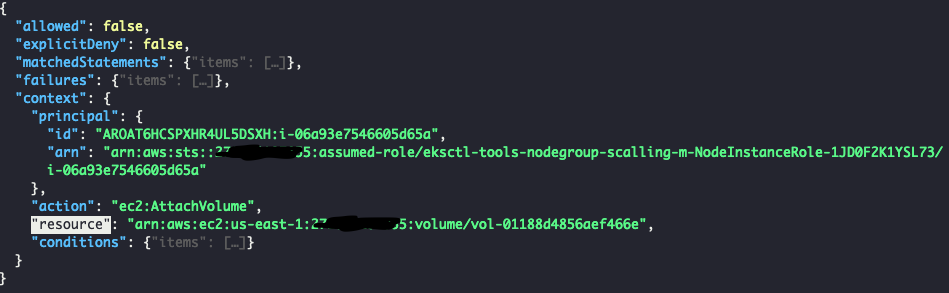

# Decoder un message d'erreur AWS

Dans Kubernetes ou autre, nous pouvons avoir un payload AWS encodé qui contient une erreur AWS, par exemple :

```
ebs-csi-controller-7d64bcb848-dnrkc ebs-plugin     rpc error: code = Internal desc = Could not attach volume "vol-0258901b6a2b73351" to node "i-06a93e7546605d65a": could not attach volume "vol-0258901b6a2b73351" to node "i-06a93e7546605d65a": UnauthorizedOperation: You are not authorized to perform this operation. Encoded authorization failure message: N1ZRrJ6sHnCD0Kf7vWhqtRr5iyt5LXi6x2HR4UZuAy3WDHA6tS-0IP1mlVzuPU9K7C2FMrqTzL8uoFLVk4e2Pp58_K8SODg-0dCNascwZgZ9ubNXzAiegkQuho1aQUO6qH7Q4RdTg4kDfl9aocvzrSpCu66z6U3_4s-sd3TjpTOrqw9Je1Umhk7LD2YetnFammK9fJSZyjvknv_7yWs08-5IpVt3EAwWGmmxvxBlHf0WbnpUP7GSE_9C3ux5tlbzOzNtX3lRmoKNbYFU2ygwNH_el4PDny_7jgjlZMnm_oGFqyo4trcPXOAZ0_Fg68qnCOSm_q2L-kXYAmMyNva238kI9ruYtUKCvd2ihOAuHQ0vQgN4rjjQ82Mu2SNwe-jSb3h2uht1vAALfT38g9AR33dIkiq43TtsEKnQiKlV29dygZal_Fwg7E1BlHl2wkj5zhWvRVN_mQ_LKY_6NQ1xnRWTqBrncCq5zxI1duoUK9nIoS_yM-a5dKNiFesqDNjtwHVMMra1mTw2vil86TnOHjaGFKg1PhCjXS9zPldWNVGvG6wdCOH38JL7xBt7iTF4saJG7skHq5XjdYmLxGTYiqP5gKTNLLKOEL9beGvAta2NpwzZJafLi7CQ0Je6Cu2yoc9eHdIgbIvziVFdGHz7Z-iePmPQ59IsHO_4Ra7oLd7tpauOKyOeKDTI9CxY_4qOkrG7C5V-alDc0RuhWWiKmcLi2BIoaIHWUebvUBgypC9XOCa4JD1q7dhQst137D6RBaISmr5FiITxaXZpg02HjPXiuf3IPkv3Krw46SeCj_k7sjpagu1dswT21ezaJv4rApbdTguHazEfpxSXCQqNJ9A0ItF
```

Heureusement, il est possible de décoder ce message pour savoir ce qu'il se passe. Pour cela, nous avons besoin de aws-cli, jq. Une petite fonction bash va faire de la magie

```bash
decode_aws () {
    error=`aws sts decode-authorization-message --encoded-message $@ | jq .DecodedMessage`
    json_err="${error:1: -1}"
    echo $json_err | gsed 's|\\"|"|g' | jq .
}
```

Nous pouvons pipe l'output vers fx pour avoir un bel affichage. Voilà ce que ça donne



On peut facilement voir ici que la polirique n'a pas la rule pour monter le volume EBS. Nous pouvons donc facilement debug le probleme :)
