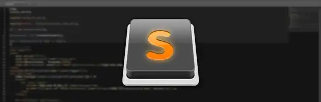
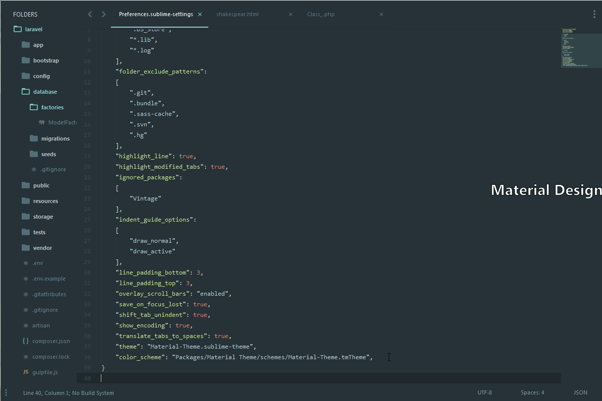

<!-- markdownlint-disable -->
# SublimeText : Le codage Efficace



## Préambule

SublimeText est actuellement l'un des éditeurs les plus prisés du
moment. Et pour cause, SublimeText gère une multitude de formats,
dispose d'une tonne de fonctionnalités, tout ça en étant simple
d'utilisation. Malgré le fait que SublimeText est de base un excellent
éditeur, il existe une multitude d'astuces, de shortcuts, et de plugins
pour encore le rendre encore plus performant, c'est ce que nous allons
voir dans ce post.

### Pré-requis

Pour fonctionner, la majorité de ces paquets auront besoin de PHP
(5.6.'* minimum), il est donc indispensable de l'avoir !

Pour les composants plus spécifiques aux plugins, nous verrons cela dans
leur section.

## Shortcuts

En règle général, si **X** fait une action, **MAJ + X** fera l'action
opposée. Par exemple, **Tab** indente la ligne, alors que **MAJ + Tab**
'"désindentera'" la ligne.

### Sublime Text

Edition
  ------------------

  **Ctrl + C**
  **Ctrl + V**
  **Ctrl + X**
  **Ctrl + ⇧ + K**
  **Ctrl + ↩**
  **Ctrl + ⇧ + ↩**
  **Ctrl + ⇧ + ↑**
  **Ctrl + ⇧ + ↓**
  **Ctrl + L**
  **Ctrl + D**
  **Ctrl + M**
  **Ctrl + ⇧ + M**
  **Ctrl + KK**
  **Ctrl + K + ⌫**
  **⇧**
  **Ctrl + ']**
  **Ctrl + '[**
  **⇧ + ⇆**
  **Ctrl + ⇧ + D**
  **Ctrl + J**
  **Ctrl + /**
  **Ctrl + ⇧ + /**
  **Ctrl + Y**
  **Ctrl + Space**

Navigation
  --------------

  **Ctrl + P**
  **Ctrl + R**

General
  ------------------

  **Ctrl + ⇧ + P**
  **Ctrl + KB**

Chercher/Remplacer
  --------------------

  **Ctrl + F**
  **Ctrl + H**
  **Ctrl + ⇧ + F**

Tabs
  ------------------

  **Ctrl + ⇧ + t**
  **Ctrl + PgDn**
  **Ctrl + PgUp**
  **Ctrl + ⇆**

Fenêtrage
  ------------------------

  **Alt + ⇧ + 2**
  **Alt + ⇧ + 1**
  **Alt + ⇧ + 5**
  **Ctrl + '[1,2,3,4']**

Favoris
  -------------------

  **Ctrl + F2**
  **F2**
  **⇧ + F2**
  **Ctrl + ⇧ + F**2

Texte manipulation
  --------------------

  **Ctrl + KU**
  **Ctrl + KL**

### Plugins

Alignment
  --------------------

  **Ctrl + Alt + A**

Color Highlighter
  -------------------

  **CTRL + ⇧ + C**

Emmet
  --------------------

  **CTRL + Alt + ↩**

Gist
  ---------------

  **CTRL + KO**
  **CTRL + KP**
  **CTRL + KI**
  **CTRL + KS**

SFTP
  ---------------------

  **CTRL + Alt + RB**
  **CTRL + Alt + UI**

Code Formatter
  --------------------

  **CTRL + Alt + F**

## Fenêtrage

De base, comme toute application, sublime texte dispose d'**une seule
fenêtre principale**, puis nous pouvons faire différents découpages :


## Configuraton

La configuration de base de SublimeText est déjà excellente, mais il y a
certaines options qui mériteraient d'être activées par défaut, mais qui
ne le sont pas.

Les modifications que nous allons faire (Et même celles pour les
plugins) n'affectent par la configuration par défaut, ce qui nous
permet de toujours avoir de vue les options par défaut si nécéssaire.

L'écriture des fichiers de configuration se fait en JSON, et est donc
facilement compréhensible.

Voici mon fichier de configuration Sublime Text :

```javascript
{
    "always_show_minimap_viewport": true,
    "bold_folder_labels": true,
    "indent_guide_options":
    [
        "draw_normal",
        "draw_active"
    ],
    "ignored_packages":
    [
      "Vintage"
    ],
    "line_padding_bottom": 3,
    "line_padding_top": 3,
    "overlay_scroll_bars": "enabled",
    "save_on_focus_lost": true,
    "highlight_line": true,
    "default_line_ending": "unix",
    "shift_tab_unindent": true,
    "show_encoding": true,
    "translate_tabs_to_spaces": true,
    "highlight_modified_tabs": true,
    "file_exclude_patterns":
    [
        ".DS_Store",
        "*.lib",
        "*.log"
    ],
    "folder_exclude_patterns":
    [
        ".git",
        ".bundle",
        ".sass-cache",
        ".svn",
        ".hg"
    ],
}
```

Nous allons décrire chaque ligne :

* `always_show_minimap_viewport` : Converse une vue sur la minimap
    d'où l'on se situe dans le fichier, utile selon moi
* `bold_folder_labels` : Permet de mettre en gras les dossiers dans
    la sidebar lors d'un projet
* `indent_guide_options` : Permet une indentation plus aisée, en
    affichant une grille d'indentation, indispensable
* `ignored_packages` : Désactive des packages (Il est impératif de
    désactiver le package Vintage pour ne pas se retrouver avec un mode
    vi)
* `line_padding_bottom` et `line_padding_bottom` : Permet une mise
    en forme plus aisée de SublimeText, nos yeux nous disent merci. La
    valeur `4` est également agréable, mais le padding est trop
    important
* `overlay_scroll_bars` : Désactive l'affichage automatique des
    bars de scroll (Qui ne sont pas utiles)
* `save_on_focus_lost` : L'option la plus utile de SublimeText,
    elle permet de sauvegarder automatiquement les onglets lorsque
    SublimeText n'est plus la fenêtre active, indispensable
* `highlight_line` : Surligne la ligne où l'on se trouve, assez
    pratique pour ne pas être perdu
* `default_line_ending` : Afin de suivre le standard, nous devons
    passer à un Line Ending format UNIX
* `shift_tab_unindent` : Autre option assez pratique, elle nous
    permet de se situer n'importe où dans la ligne pour défaire
    l'indentation, et non plus seulement au début de la ligne
* `show_encoding` : Affiche l'encodage actuel du fichier, pratique
    pour vérifier si l'on est en UTF-8
* `translate_tabs_to_spaces` : Convertit les tabs en espace. Peut
    être utile afin de s'assurer que notre tabsize sera identique de
    partout
* `file_exclude_patterns` et `folder_exclude_patterns` : Permet
    d'exclure des fichiers de la sidebar. Un grand nombre d'éléments
    sont ignorés par défaut, mais cependant, il en manque certains

Pour correspondre parfaitement au PSR, je vous indique à aller voir le
post de [ce
monsieur](http://joshfrankel.me/blog/2014/how%20to/How-to-configure-sublime-text-for-psr-standards/),
ainsi que les liens officiels des PSR :

* [PSR-2](http://www.php-fig.org/psr/psr-2/)
* [PSR-1](http://www.php-fig.org/psr/psr-1/)

## Thèmes

De base, je trouve le thème de SublimeText tout simplement affreux,
c'est pour cela que j'ai sélectionné 2 thèmes que je juge superbes.

### Material Design

**[Material Theme](https://github.com/equinusocio/material-theme)** est
un thème se basant sur le Material Design, règles développées par Google
et très à la vogue en ce moment. Le **Material Theme** se décompose en
plusieurs teintes :

* **Normal** qui est le thème de base
* **Darker** le thème plus foncé
* **Lighter** le thème plus clair

Le dépot Github inclut également des colorations syntaxiques
additionnelles :

* **OceanicNext**
* **OceanicNext Darker**

Voici le thème :



Comme vous pouvez le voir, le thème *Material Theme* ainsi que *Material
Theme Darker* sont agréables et reposant, contrairement au thème
*Material Theme Lighter* qui est tout simplement un suicide visuel.

Voici les différents paramètres pour les différents thèmes :

* **Sublime Material Lighter**

```javascript
"theme": "Material-Theme-Lighter.sublime-theme",
"color_scheme": "Packages/Material Theme/schemes/Material-Theme-Lighter.tmTheme",
```

* **Sublime Material**

```javascript
"theme": "Material-Theme.sublime-theme",
"color_scheme": "Packages/Material Theme/schemes/Material-Theme.tmTheme",
```

* **Sublime Material Darker**

```javascript
"theme": "Material-Theme-Darker.sublime-theme",
"color_scheme": "Packages/Material Theme/schemes/Material-Theme-Darker.tmTheme",
```

En plus du thème '"basique'", Material Theme dispose d'une Appbar :
[Material Theme
Appabar](https://github.com/equinusocio/material-theme-appbar), celle-ci
completera votre thème avec une couleur originale pour la liste des
fichiers.

Voici un aperçu des couleurs : **A FAIRE**

<https://github.com/equinusocio/material-theme-appbar>'
<https://github.com/jamiewilson/predawn>'
<https://gist.github.com/PixiBixi/e401f57cb05f070d0a96d1859302225a>
(Predawn Theme Settings)
<https://gist.github.com/PixiBixi/1cefb66eccd1612a85c4d0e6d1d04ffc>
(Material Design Settings)

## Snippets

<https://github.com/JasonMortonNZ/bs3-sublime-plugin>'
<https://github.com/idleberg/sublime-icon-fonts>'

### Plugins

### Divers

[Package Control](https://packagecontrol.io/installation) est un peu
comme l'*apt-get* pour SublimeText, il en convient donc qu'il s'agit
actuellement d'un plugin indispensable pour un usage convenable de
SublimeText

**Attention, même si Package Control s'avère très pratique, il est
avéré que la plupart des versions ne sont plus mises à jour, il en
conviendra donc d'installer la plupart du temps les plugins via leur
dépot Git, ou bien toute autre source officielle**

### PHP

<https://github.com/benmatselby/sublime-phpcs>

<https://github.com/spadgos/sublime-jsdocs>

<https://github.com/erichard/SublimePHPCompanion>

### CSS

<https://github.com/weslly/ColorPicker>

<https://github.com/Monnoroch/ColorHighlighter>

<https://github.com/sindresorhus/sublime-autoprefixer>

### Configuration

<https://github.com/colinta/ApacheConf.tmLanguage>

<https://github.com/brandonwamboldt/sublime-nginx>

<https://github.com/condemil/Gist>

<https://github.com/sixty4k/st2-zonefile>

<https://github.com/chrissimpkins/glue>

### Tout et rien

<https://github.com/wbond/sublime_alignment/>

<https://github.com/mrmartineau/Placeholders>

<https://github.com/akalongman/sublimetext-codeformatter>

<https://github.com/al63/SublimeFiles>

<https://github.com/liamja/sublime-nfo>

### SQL ###

<https://github.com/freewizard/SublimeFormatSQL>

<https://github.com/alienhard/SublimeAllAutocomplete>

<https://github.com/facelessuser/BracketHighlighter>

<https://github.com/aziz/PlainTasks>

<https://packagecontrol.io/packages/Minify>

<https://github.com/sergeche/emmet-sublime>

<https://github.com/titoBouzout/SideBarEnhancements>

<https://github.com/wbond/sublime_terminal>

<https://github.com/skuroda/Sublime-AdvancedNewFile>

<https://github.com/BoundInCode/AutoFileName>

<https://wbond.net/sublime_packages/sftp>
<!-- markdownlint-enable -->
