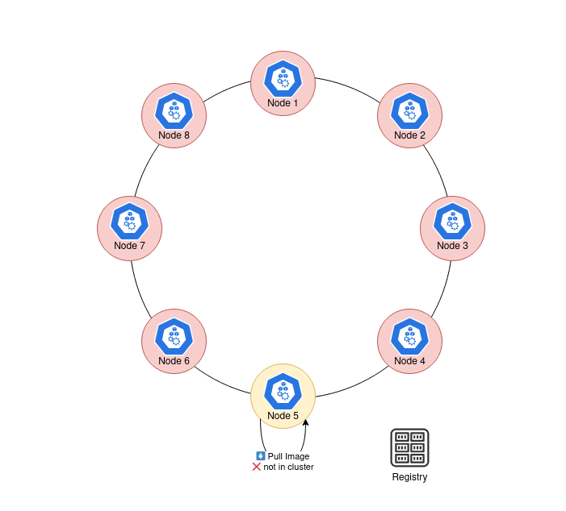

# Spegel : Un OCI registry cache stateless

## Introduction

Dans les clusters Kubernetes, les services sont souvent déployés ou mis à jour fréquemment. Or, chaque noeud renfile les images depuis des registres distants — ce qui surcharge ces registres et peut déclencher des limitations (notamment sur DockerHub). **Spegel**, en tant que proxy de cache d’images local vise à résoudre ce problème en accélérant la distribution des images et en améliorant l’efficacité globale du déploiement.

> **Important** : pour l’instant, Spegel ne prend en charge que **Containerd**, pas Docker.

---

## Principe de fonctionnement

Spegel est déployé sur chaque noeud en daemonset du cluster comme un proxy‐cache local. Lorsqu’un noeud tente de tirer une image :



1. Il interroge d’abord Spegel local.
2. Si l’image est déjà en cache, elle est servie directement, sans passer par le registre distant.
3. Sinon, l’image est téléchargée depuis le registre distant, puis stockée dans le cache local, pour les requêtes futures.

Pour que cela fonctionne de façon transparente, on utilise le mécanisme de *Registry Mirror* de Containerd, redirigeant les requêtes vers Spegel.

## Compatibilité

Comme Spegel requière certains parmètres, il n'est pas compatible avec tous les clusters Kubernetes. Je vous invite à voir le tableau de compatibilité sur le [site officiel](https://spegel.dev/docs/getting-started/#compatibility)

## Installation

### Helm chart

Pour l'installer, plusieurs méthodes s'offrent à vous, la méthode la plus simple est via le helm chart fournit

```bash
helm upgrade --create-namespace --namespace spegel --install spegel oci://ghcr.io/spegel-org/helm-charts/spegel
```

### Kustomize

Si votre outil de déploiement utilise Kustomize (ArgoCD/FluxCD), vous pouvez l'installer très facilement :

```yaml
helmCharts:
  - name: spegel
    repo: oci://ghcr.io/spegel-org/helm-charts
    releaseName: spegel
    namespace: spegel
    valuesFile: values.yaml
```

Par defaut, le `values.yaml` ne nécesite quasiment aucune modification hormis l'activation du serviceMonitor si vous disposez de la CRD

---

## Configuration de Containerd

Spegel requiert que le paramètre `discard_unpacked_layers` dans la configuration de Containerd soit désactivé (`false`).
Modifiez le fichier `/etc/containerd/config.toml` :

```toml
discard_unpacked_layers = false
```

### Pour EKS

Pour EKS, voici un petit script utilisable pour le rendre Spegel friendly :

```bash
grep "discard_unpacked_layers" /etc/containerd/config.toml && \
sudo cp /etc/containerd/config.toml /etc/containerd/config.toml.bak && \
sudo sed -i 's/^\(\s*\)discard_unpacked_layers\s*=\s*true/\1discard_unpacked_layers = false/' /etc/containerd/config.toml && \
grep "discard_unpacked_layers" /etc/containerd/config.toml && \
sudo systemctl restart containerd
```

## Test de fonctionnement

Afin d'être sur que Spegel fonctionne correctement, vous devriez observer ce genre de lignes de logs :

```bash
spegel-l75n8 registry {"time":"2025-10-25T16:34:14.191396548Z","level":"INFO","source":{"function":"github.com/spegel-org/spegel/pkg/state.Track","file":"github.com/spegel-org/spegel/pkg/state/state.go","line":86},"msg":"OCI event","key":"docker.io/library/nginx:latest","type":"CREATE"}
spegel-l75n8 registry {"time":"2025-10-25T16:34:14.236101335Z","level":"INFO","source":{"function":"github.com/spegel-org/spegel/pkg/state.Track","file":"github.com/spegel-org/spegel/pkg/state/state.go","line":86},"msg":"OCI event","key":"sha256:029d4461bd98f124e531380505ceea2072418fdf28752aa73b7b273ba3048903","type":"CREATE"}
```

L'image n'est pas disponible sur le noeud et est donc créée

On s'apercoit au 2eme pull que celui-ci ne dure que quelques milisecondes vs une dizaine de seconde dans notre premier cas
