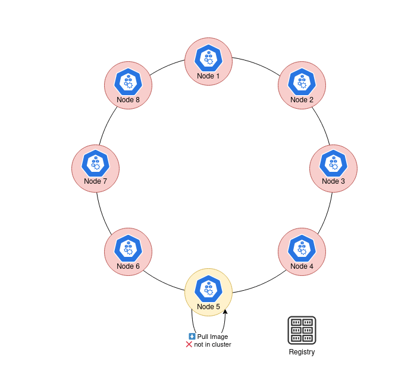

# Spegel : Un OCI registry cache stateless

Dans les clusters Kubernetes, chaque nœud pull les images depuis des registres distants — ce qui surcharge ces registres et peut déclencher des rate limits (notamment sur DockerHub). **Spegel** est un proxy de cache d'images local qui vise à résoudre ce problème en accélérant la distribution des images.

!!! warning "Containerd uniquement"
    Spegel ne prend en charge que **Containerd**, pas Docker.

## Principe de fonctionnement

Spegel est déployé sur chaque nœud en daemonset comme un proxy-cache local. Lorsqu'un nœud tente de tirer une image :



1. Il interroge d'abord Spegel local.
2. Si l'image est déjà en cache, elle est servie directement, sans passer par le registre distant.
3. Sinon, l'image est téléchargée depuis le registre distant, puis stockée dans le cache local pour les requêtes futures.

Pour que cela fonctionne de façon transparente, on utilise le mécanisme de *Registry Mirror* de Containerd, qui redirige les requêtes vers Spegel.

## Compatibilité

Spegel requiert certains paramètres spécifiques — il n'est pas compatible avec tous les clusters. Le tableau de compatibilité est disponible sur le [site officiel](https://spegel.dev/docs/getting-started/#compatibility).

## Installation

### Helm chart

La méthode la plus simple est via le helm chart fourni :

```bash
helm upgrade --create-namespace --namespace spegel --install spegel oci://ghcr.io/spegel-org/helm-charts/spegel
```

### Kustomize

Si l'outil de déploiement utilise Kustomize (ArgoCD/FluxCD) :

```yaml
helmCharts:
  - name: spegel
    repo: oci://ghcr.io/spegel-org/helm-charts
    releaseName: spegel
    namespace: spegel
    valuesFile: values.yaml
```

Par défaut, le `values.yaml` ne nécessite quasiment aucune modification hormis l'activation du serviceMonitor si on dispose de la CRD.

## Configuration de Containerd

Spegel requiert que le paramètre `discard_unpacked_layers` dans la configuration de Containerd soit désactivé (`false`).
Modifier le fichier `/etc/containerd/config.toml` :

```toml
discard_unpacked_layers = false
```

### Pour EKS

Petit script pour rendre un nœud EKS Spegel-compatible :

```bash
grep "discard_unpacked_layers" /etc/containerd/config.toml && \
sudo cp /etc/containerd/config.toml /etc/containerd/config.toml.bak && \
sudo sed -i 's/^\(\s*\)discard_unpacked_layers\s*=\s*true/\1discard_unpacked_layers = false/' /etc/containerd/config.toml && \
grep "discard_unpacked_layers" /etc/containerd/config.toml && \
sudo systemctl restart containerd
```

## Test de fonctionnement

Pour vérifier que Spegel fonctionne, on devrait observer ce genre de lignes dans les logs :

```bash
spegel-l75n8 registry {"time":"2025-10-25T16:34:14.191396548Z","level":"INFO","source":{"function":"github.com/spegel-org/spegel/pkg/state.Track","file":"github.com/spegel-org/spegel/pkg/state/state.go","line":86},"msg":"OCI event","key":"docker.io/library/nginx:latest","type":"CREATE"}
spegel-l75n8 registry {"time":"2025-10-25T16:34:14.236101335Z","level":"INFO","source":{"function":"github.com/spegel-org/spegel/pkg/state.Track","file":"github.com/spegel-org/spegel/pkg/state/state.go","line":86},"msg":"OCI event","key":"sha256:029d4461bd98f124e531380505ceea2072418fdf28752aa73b7b273ba3048903","type":"CREATE"}
```

L'image n'est pas disponible sur le nœud et est donc créée. Au 2ème pull, on s'aperçoit que celui-ci ne dure que quelques millisecondes vs une dizaine de secondes au premier pull.
