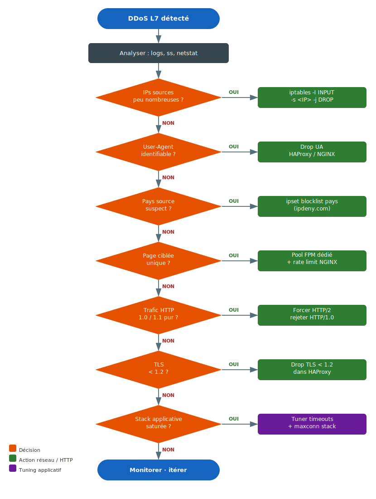

# Mitigation DDoS L7

Un DDoS Layer 7 cible la couche applicative (HTTP/HTTPS) plutôt que la
bande passante réseau. L'objectif est d'épuiser les ressources applicatives :
workers PHP-FPM, connexions HAProxy, pool de threads NGINX.



---

## Étape 1 : identifier l'attaque

Avant de bloquer quoi que ce soit, caractériser le trafic malveillant.

```bash
# Top des IPs sources
netstat -ntu | awk '{print $5}' | cut -d: -f1 | sort | uniq -c | sort -rn | head -20

# Avec ss (plus rapide)
ss -tn | awk '{print $5}' | cut -d: -f1 | sort | uniq -c | sort -rn | head -20

# Connexions actives par état
ss -tn | awk '{print $1}' | sort | uniq -c

# Requêtes en cours dans les logs NGINX (temps réel)
tail -f /var/log/nginx/access.log | awk '{print $1, $7}' | uniq -c -f2 | sort -rn

# Top des User-Agents
awk '{print $12}' /var/log/nginx/access.log | sort | uniq -c | sort -rn | head -20

# Top des URLs ciblées
awk '{print $7}' /var/log/nginx/access.log | sort | uniq -c | sort -rn | head -20

# Top des pays sources (si geoip disponible)
awk '{print $1}' /var/log/nginx/access.log | \
    xargs -I{} geoiplookup {} | awk -F: '{print $2}' | sort | uniq -c | sort -rn | head -10
```

---

## Étape 2 : blocage réseau rapide

### Bloquer une IP ou un range

```bash
# Bloquer une IP immédiatement
iptables -I INPUT -s 1.2.3.4 -j DROP

# Bloquer un range CIDR
iptables -I INPUT -s 1.2.3.0/24 -j DROP

# Vérifier
iptables -L INPUT -n --line-numbers | head -20
```

### Blocage par pays avec ipset

```bash
# Créer un set pour un pays (ex: CN)
ipset create blocklist hash:net

# Ajouter les ranges du pays (via ipdeny.com)
wget -q https://www.ipdeny.com/ipblocks/data/countries/cn.zone -O /tmp/cn.zone
while IFS= read -r cidr; do ipset add blocklist "$cidr"; done < /tmp/cn.zone

# Appliquer le blocage
iptables -I INPUT -m set --match-set blocklist src -j DROP
```

Voir [ipset](../security/ipset.md) pour la gestion persistante des sets.

---

## Étape 3 : filtrage HAProxy

HAProxy est la première couche applicative — c'est là qu'on filtre le plus
efficacement avec le moins d'impact sur les workers backend.

### Rate limiting par IP

```haproxy
frontend http_front
    # Tracker les connexions par IP (table de 100k entrées, expiration 30s)
    stick-table type ip size 100k expire 30s store conn_cur,conn_rate(10s),http_req_rate(10s)
    tcp-request connection track-sc0 src

    # Bloquer si > 100 req/10s
    acl too_many_req sc_http_req_rate(0) gt 100
    http-request deny deny_status 429 if too_many_req

    # Bloquer si > 50 connexions simultanées par IP
    acl too_many_conn sc_conn_cur(0) gt 50
    tcp-request connection reject if too_many_conn
```

### Filtrage User-Agent

```haproxy
frontend http_front
    acl bad_ua hdr_sub(User-Agent) -i python-requests curl libwww-perl
    acl empty_ua hdr_len(User-Agent) eq 0
    http-request deny if bad_ua or empty_ua
```

### Forcer HTTP/2 et TLS récent

```haproxy
frontend https_front
    bind *:443 ssl crt /etc/ssl/certs/site.pem alpn h2,http/1.1

    # Rejeter TLS < 1.2
    acl old_tls ssl_fc_protocol lt TLSv1.2
    tcp-request connection reject if old_tls
```

### Tuning maxconn et timeouts

```haproxy
defaults
    maxconn 10000
    timeout connect 3s
    timeout client  10s    # réduire pour libérer vite les connexions pendantes
    timeout server  30s

frontend http_front
    maxconn 5000           # limite globale du frontend
```

---

## Étape 4 : filtrage NGINX

### Rate limiting

```nginx
# Dans http {}
limit_req_zone $binary_remote_addr zone=req_limit:10m rate=30r/m;
limit_conn_zone $binary_remote_addr zone=conn_limit:10m;

# Dans server {} ou location {}
location /login {
    limit_req zone=req_limit burst=5 nodelay;
    limit_conn conn_limit 10;
    limit_req_status 429;
}
```

### Pool FPM dédié pour les pages sensibles

Si l'attaque cible `/login` ou `/api` : isoler avec un pool PHP-FPM distinct
pour ne pas saturer le pool principal.

```nginx
location /login {
    fastcgi_pass unix:/run/php/php-fpm-login.sock;
    include fastcgi_params;
}
```

```ini title="/etc/php/8.x/fpm/pool.d/login.conf"
[login]
listen = /run/php/php-fpm-login.sock
pm = static
pm.max_children = 10   # limiter volontairement
```

### Bloquer User-Agent et requêtes vides

```nginx
# Bloquer User-Agents malveillants
map $http_user_agent $bad_agent {
    default         0;
    ~*python        1;
    ~*libwww        1;
    ""              1;   # User-Agent vide
}

server {
    if ($bad_agent) { return 444; }  # 444 = ferme la connexion sans réponse
}
```

### Forcer HTTPS et TLS récent

```nginx
ssl_protocols TLSv1.2 TLSv1.3;
ssl_ciphers ECDHE-ECDSA-AES128-GCM-SHA256:ECDHE-RSA-AES128-GCM-SHA256;
ssl_prefer_server_ciphers off;
```

---

## Étape 5 : tuning PHP-FPM

```ini
; Réduire le nombre de workers disponibles pour forcer le rejet rapide
pm = dynamic
pm.max_children = 50
pm.max_requests = 500       ; recycler les workers régulièrement

; Timeout court pour libérer les workers bloqués
request_terminate_timeout = 10s
```

---

## Checklist de triage rapide

```text
[ ] Identifier les IPs sources → bloquer en iptables si peu nombreuses
[ ] Page ciblée fixe ?    → pool FPM dédié + rate limit NGINX sur la route
[ ] User-Agent identique ? → drop UA dans HAProxy/NGINX
[ ] Pays source suspect ?  → blocage ipset pays
[ ] HTTP/1.0 ou 1.1 pur ?  → forcer HTTP/2 + rejeter les anciens protocols
[ ] TLS faible ?           → drop TLS < 1.2 dans HAProxy
[ ] Stack saturée ?        → réduire timeouts + ajuster maxconn sur toute la chaîne
```
