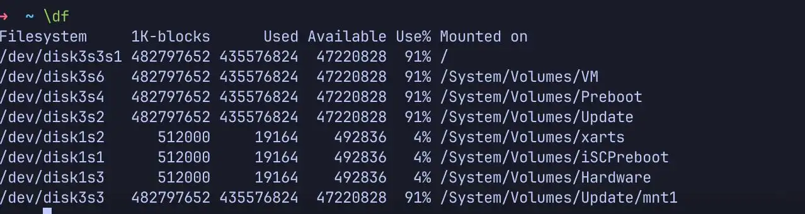
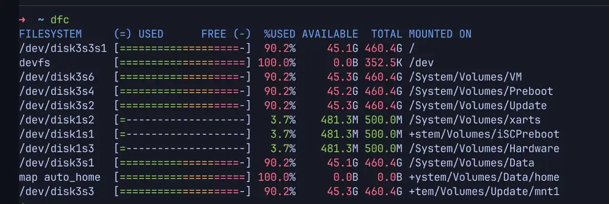

# DFC, la commande DF en plus

## Présentation

**dfc** est un petit utilitaire rendant la commande **df** dépassée. En
effet, dfc est beaucoup plus clair que la commande df, et supporte
également les couleurs.

Comme des images sont plus représentatives, voilà les deux commandes :

**df :**



**dfc :**



Comme vous pouvez, le voir, le résultat est quasiment identique, mais
**dfc** est bien plus clair.

## Installation

### Wheezy

Sous Wheezy, il n'y a rien à faire, vu que le paquet est dans les
dépots de base, donc on l'installe comme d'habitude :

```bash
apt-get -y install dfc
```

La version téléchargé est la 2.5.0, à l'heure actuelle, nous sommes à
la 3.0.5. Cependant, aucun ajout utile ne nécéssite une upgrade, vous
pouvez donc soit compiler à la main, soit installer depuis les dépots.
Le *changelog* est disponible
[ici](https://github.com/Rolinh/dfc/blob/master/CHANGELOG.md)

Puis nous l'utilisons simplement via la commande dfc

### Jessie

Sous Jessie, cela se complique un peu, nous devons le compiler à la
main, étant donné qu'aucun paquet n'est disponible dans les sources de
base.

On commence par installer les pré-requis pour compiler **dfc**

```bash
apt-get -y install cmake gettext git-core
```

On télécharge les sources

```bash
git clone https://github.com/Rolinh/dfc
```

On se rend dans le dossier de téléchargement de dfc

```bash
cd dfc
```

On créé un dossier nécéssaire à la compilation

```bash
mkdir build && cd build
```

Et enfin, on lance la compilation

```bash
cmake .. && make && make install
```

### Stretch et Supérieur

A partir de Debian Stretch, dfc est rentré dans les repositories, il
n'est donc plus nécessaire de le compiler.

```bash
apt update && apt install -y dfc
```

## Bonus

Nous pouvons totalement se passer de **df** en le remplaçant par **dfc**
via un alias dans le .bashrc

```bash
echo "alias df=dfc" >> ~/.bashrc
```
