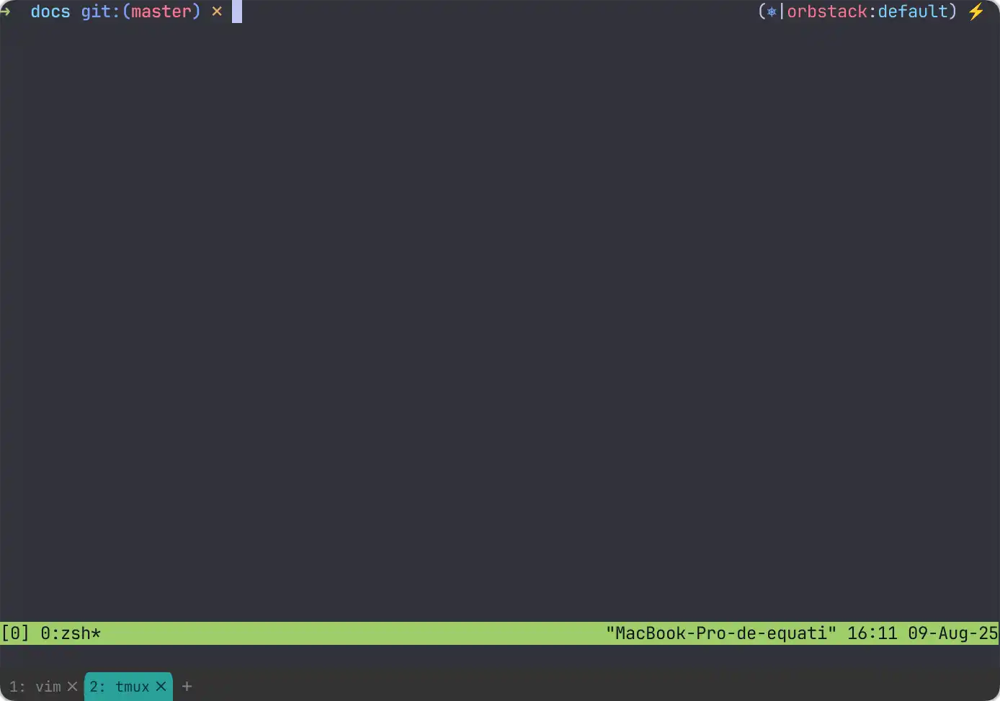

# tmux

tmux est un multiplexeur de terminal : il permet de gérer plusieurs fenêtres
et panneaux dans une seule session, de détacher/réattacher des sessions, et
de lancer des processus persistants même après déconnexion SSH.

```bash
# Installation
apt install tmux        # Debian/Ubuntu
brew install tmux       # macOS
```

---

## Concepts

| Terme | Description |
|-------|-------------|
| **Session** | Contexte de travail indépendant, survit à la déconnexion |
| **Window** | Onglet dans une session (comme un onglet de navigateur) |
| **Pane** | Subdivision d'une window (split horizontal ou vertical) |

Le préfixe par défaut est `Ctrl+B` — toutes les commandes ci-dessous
s'utilisent après ce préfixe.

---

## Sessions

```bash
# Créer une nouvelle session
tmux new -s nom

# Lister les sessions actives
tmux ls

# Réattacher à une session
tmux attach -t nom
tmux a           # réattache à la dernière session

# Tuer une session
tmux kill-session -t nom
```

| Raccourci | Action |
|-----------|--------|
| `d` | Détacher la session (reste en arrière-plan) |
| `$` | Renommer la session courante |
| `s` | Lister et switcher entre sessions |
| `(` / `)` | Session précédente / suivante |

---

## Windows (onglets)

| Raccourci | Action |
|-----------|--------|
| `c` | Créer une nouvelle window |
| `,` | Renommer la window courante |
| `n` / `p` | Window suivante / précédente |
| `0`–`9` | Aller directement à la window N |
| `w` | Lister toutes les windows |
| `&` | Fermer la window courante |

---

## Panes (splits)



| Raccourci | Action |
|-----------|--------|
| `%` | Split vertical (côte à côte) |
| `"` | Split horizontal (haut / bas) |
| `←↑→↓` | Naviguer entre les panes |
| `z` | Zoom sur le pane courant (toggle) |
| `x` | Fermer le pane courant |
| `{` / `}` | Déplacer le pane (swap) |
| `Space` | Changer de disposition automatiquement |
| `q` | Afficher les numéros de pane |

### Redimensionner un pane

Maintenir `Ctrl+B` puis utiliser les flèches, ou :

```bash
# Depuis la ligne de commande tmux (:)
resize-pane -D 5    # agrandir vers le bas de 5 lignes
resize-pane -U 5
resize-pane -L 10
resize-pane -R 10
```

---

## Mode copie (scroll & sélection)

```text
Ctrl+B [          → entrer en mode copie
q                 → quitter le mode copie
Espace            → commencer la sélection (mode vi)
Entrée            → copier la sélection
Ctrl+B ]          → coller
```

Activer le mode vi dans `~/.tmux.conf` :

```bash
set-window-option -g mode-keys vi
```

---

## Configuration

Fichier `~/.tmux.conf` — rechargeable sans redémarrer :

```bash
tmux source-file ~/.tmux.conf
# ou depuis tmux : Ctrl+B :source-file ~/.tmux.conf
```

### Réorganisation automatique des panes

```bash
# Appliquer automatiquement le layout tiled quand un pane est fermé
set-hook -g after-kill-pane 'select-layout tiled'
set-hook -g pane-exited 'select-layout tiled'
```

### Autres réglages utiles

```bash
# Numérotation à partir de 1 (plus intuitif avec le clavier)
set -g base-index 1
setw -g pane-base-index 1

# Historique étendu
set -g history-limit 50000

# Activer la souris
set -g mouse on

# Délai après Escape (utile avec vim)
set -sg escape-time 10

# Activer les couleurs 256
set -g default-terminal "screen-256color"
```

!!! tip "Config communautaire"
    [gpakosz/.tmux](https://github.com/gpakosz/.tmux) est une configuration
    de référence très complète avec barre de statut enrichie et de nombreux
    raccourcis préconfigurés.

---

## Commandes utiles en ligne de commande

```bash
# Exécuter une commande dans une session existante (sans s'y attacher)
tmux send-keys -t nom:window.pane "commande" Enter

# Créer une session avec une commande lancée directement
tmux new -s deploy -d "bash /opt/deploy.sh"

# Diffuser la même frappe dans tous les panes d'une window
tmux set-window-option synchronize-panes on
# (utile pour exécuter la même commande sur N serveurs simultanément)
```

---

## tmux-xpanes : batch SSH

[tmux-xpanes](https://github.com/greymd/tmux-xpanes) automatise l'ouverture
de multiples panes — particulièrement utile pour se connecter à un batch
de serveurs en parallèle.

```bash
# Installation
brew install tmux-xpanes

# Alias dans .zsh_alias
alias csshx='tmux-xpanes --ssh'
```

### Ouvrir des sessions SSH en masse

```bash
# Sur une liste explicite
csshx web01 web02 web03

# Depuis un inventaire Ansible
csshx $(grep "kafka-" inventory | sed "s/://g")

# Depuis un pattern dans /etc/hosts
csshx $(awk '/kafka-/{print $2}' /etc/hosts)
```

Une fois les panes ouverts, activer la synchronisation pour taper
la même commande sur tous les serveurs simultanément :

```bash
Ctrl+B : set-window-option synchronize-panes on
```

---

## Intégration vim / neovim

Pour activer la souris dans vim à l'intérieur de tmux :

```vim
set ttymouse=xterm2
set mouse=a
```

Avec neovim, `set mouse=a` suffit — `ttymouse` n'est pas nécessaire.
