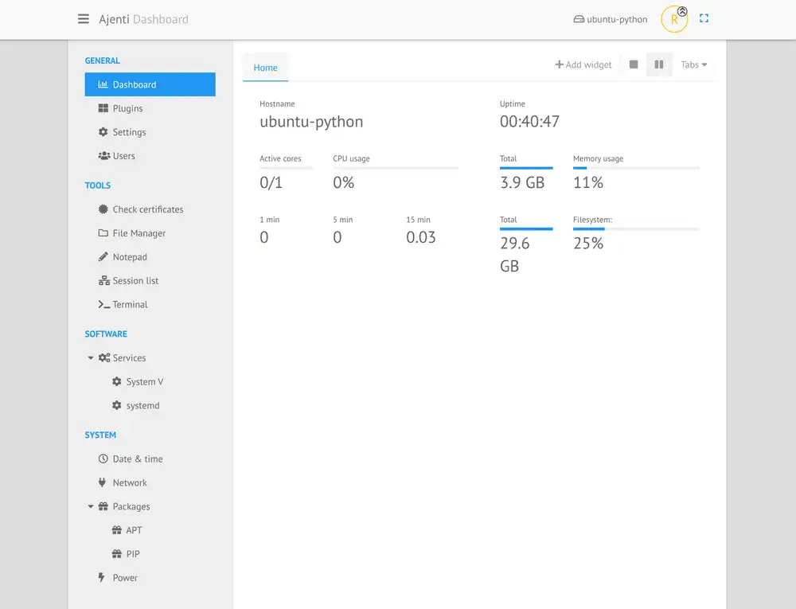

# Gérer son serveur en ligne via Ajenti



A l'instar de Webmin ou encore Vesta, Ajenti est un panel
d'administration de serveur. Simple et efficace, il vous permettra
d'effectuer la grande majorité des actions courantes (Reboot du
serveur, edition des configurations, du firewall...)

## Installation

Pour l'installer, il vaut mieux utiliser la source officielle. Les
packages Debian étant assez vieux.

```bash
curl https://raw.githubusercontent.com/ajenti/ajenti/master/scripts/install.sh | sudo bash -s -
```

Pour plus de méthode d'installation, aller voir le [lien officiel](https://docs.ajenti.org/en/latest/man/install.html#installing)

Puis on installe le package

```bash
apt-get update && apt-get install ajenti
```

Si l'installation est bonne, vous pourrez accéder à ajenti via le port
8000, les identifiants par défaut sont **root** et **admin**
