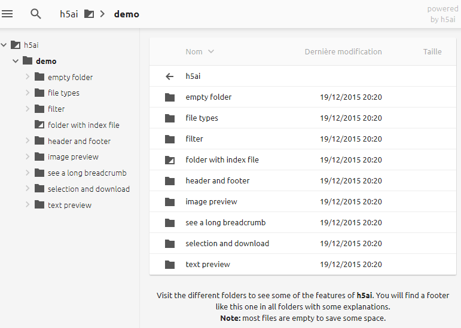

# Partager ses fichiers avec H5ai



## Présentation

h5ai est un index amélioré afin de partager facilement tous vos
fichiers... Celui-ci remplacera aisément un index fade et sans gout.
Celui- ci est disponible pour tous les serveurs web, à condition
d'avoir au minimum la version 5.5 de PHP.

## Installation

Tout d'abord, nous devons faire un lien symbolique vers notre www, et
le folder que nous souhaitons rendre accessible publiquement.

Pour moi, je souhaite rendre `/home/jeremy/files/` accessible publiquement

```bash
ln -s /home/jeremy/files/ /var/www/downloads
```

Il convient comme nom d'usage d'utiliser downloads en folder de
destination

Puis dans ce dossier, nous allons télécharger h5ai

```bash
cd /var/www/downloads/
wget https://release.larsjung.de/h5ai/h5ai-0.28.1.zip
```

N'oublier pas de vous rendre [ici](https://release.larsjung.de/h5ai/)
afin de consulter les dernières versions de h5ai disponibles

Enfin, nous extrayons l'archive, puis nous renommons **'_h5ai** en
**.h5ai** afin de ne pas le voir dans l'explorateur.

```bash
unzip h5ai-0.28.1.zip
mv _h5ai .h5ai
```

On n'oublie pas de donner les droits adéquats

```bash
chown -R www-data:www-data .h5ai
```

Et enfin, on créer le server-block NGINX adéquat, sans oublier de faire le bon CNAME

```nginx
server {
    server_name downloads.titi.ovh;
    listen 80;
    listen [::]:80;
    return 301 https://$host$request_uri;
}
server {
    listen 443 ssl http2;
    listen [::]:443 ssl http2;
    server_name downloads.titi.ovh;

    error_log /var/log/nginx/downloads.error.log;
    access_log /var/log/nginx/downloads.access.log;

    include /etc/nginx/conf.d/cache.conf;
    include /etc/nginx/conf.d/php.conf;
    include /etc/nginx/conf.d/ssl.conf;
    include /etc/nginx/conf.d/file_protect.conf;

    auth_basic "Downloads";
    auth_basic_user_file "/etc/nginx/passwd/rutorrent_passwd";

    root /var/www/downloads;
    index  index.html  index.php /.h5ai/public/index.php;

    autoindex on;
}
```

La dernière ligne **autoindex on** est cruciale, car c'est elle qui va permettre de lister le contenu.
