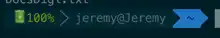

# Enlever le premier caractère bizarre de iTerm

Comme une image vaut 1000 mots :

Nous voyons ici que nous avons un premier caractère bleu ciel indésirable.

Pour l'enlever, il faut décocher **Show Mark Indicators** dans **Profile** '> **Terminal** '> **Shell Integration** (Tout en bas)

Grace à cette minuscule option, nous retrouvons un shell sympathique à utiliser

