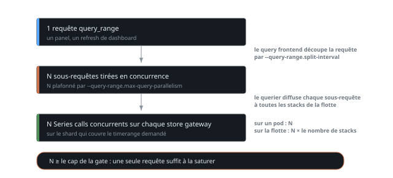

# La concurrence de lecture Thanos : amplification, gates et diagnostic

Une gate de store gateway protège un pod à la fois. Le nombre qu'on y met n'a donc de sens qu'en regard de ce qui arrive en face, or ce qui arrive en face n'est pas le nombre de requêtes utilisateur : c'est ce nombre multiplié 2 fois, une fois par le découpage du query frontend et une fois par le fan-out du querier.

Le symptôme de départ est déroutant : une gate collée à son plafond pendant que le trafic entrant ne bouge pas d'un pouce sur 24h. Cet article va de ce symptôme jusqu'à l'invariant qui empêche qu'il revienne. Le reste de la plateforme est décrit dans [Thanos at scale](thanos.md), qui couvre le sharding temporel et les limites de lecture.

## Une requête utilisateur n'est pas une requête

Le query frontend découpe chaque `query_range` en tranches de `--query-range.split-interval` et en tire jusqu'à `--query-range.max-query-parallelism` **en concurrence**. Chaque sous-requête atteint un querier, qui la diffuse à tous les store endpoints qu'il connaît, donc à toutes les stacks de la flotte.



Le point qui compte est la distinction entre les 2 nombres du bas. Sur la flotte, une requête produit le parallélisme multiplié par le nombre de stacks. Mais sur **un** pod donné, elle produit exactement le parallélisme, puisque chaque sous-requête ne fait qu'un seul Series call par store gateway. C'est ce second nombre qui se compare au cap de la gate. C'est aussi celui qu'on oublie.

Le sharding par timerange concentre encore le tir. Comme [chaque shard couvre une plage](thanos.md#un-shard-par-timerange), un dashboard sur 7 jours ne tape pas les shards au hasard : il tombe sur le même shard de toutes les stacks à la fois, donc sur 2 pods par stack et pas un de plus.

Mesuré sur une vingtaine de stacks, l'amplification tourne autour de 2,5 Series calls par requête HTTP entrante en régime normal et monte à 84 en pic. Le dénominateur compte aussi les requêtes instantanées, qui ne se découpent jamais et que le query frontend [ne cache pas](thanos-cache.md), donc le chiffre de base est dilué par elles et le vrai facteur sur les seules `query_range` est plus élevé.

!!! warning "`--labels.max-query-parallelism` fait la même chose, sur un chemin plus fréquent"
    Il porte sur les endpoints de labels, ceux qui résolvent les variables de template. Ils sont sollicités à chaque chargement de dashboard, avant même le premier panel, donc un parallélisme élevé y coûte plus souvent que sur les `query_range`.

## Décomposer une saturation en débit et en durée

Le nombre d'appels en vol suit la loi de Little, `in_flight = λ × T`, où λ est le débit d'arrivée sur le pod et T la durée moyenne d'un appel. Une gate saturée ne dit pas lequel des 2 termes a bougé, alors que les leviers ne sont pas les mêmes.

Les 2 termes se lisent séparément. Le débit d'arrivée par pod se prend sur le compteur de la gate.

```promql
sum by (namespace, pod) (rate(thanos_bucket_store_series_gate_queries_total[5m]))
```

La durée moyenne d'un Series call se prend sur l'histogramme gRPC du serveur.

```promql
  sum(rate(grpc_server_handling_seconds_sum{grpc_method="Series"}[5m]))
/ sum(rate(grpc_server_handling_seconds_count{grpc_method="Series"}[5m]))
```

Le résultat surprend. Entre le régime normal et le pic, le débit fait x4,5 alors que la durée fait x190, de 0,7 ms à 132 ms de moyenne. C'est la durée qui domine largement, ce qui veut dire qu'un graphe de QPS seul, celui qu'on regarde en premier, ne dit à peu près rien de la saturation.

La moyenne ne suffit pas non plus, la queue fait le reste du travail : les appels du dernier millième se comptent en secondes. Il n'en faut pas beaucoup à quelques secondes pour remplir une gate. C'est le même piège que sur la latence utilisateur, où [p99 ne voit structurellement pas une population lente à 0,1 %](thanos.md#mettre-des-limites-en-lecture-et-en-ingestion).

D'où 2 familles de leviers, une par terme. Pour borner λ, c'est le parallélisme en amont. Pour borner T, ce sont les limites par requête sur la store gateway, `--store.limits.request-series` et `--store.limits.request-samples`, qui valent 0 par défaut, c'est-à-dire aucune limite.

## Ordonner les limites de concurrence

3 limites se suivent sur le chemin de lecture et elles ne sont pas interchangeables.

| Flag | Composant | Rôle |
|---|---|---|
| `--query-range.max-query-parallelism` | query frontend | multiplicateur, 14 par défaut |
| `--query.max-concurrent` | querier | requêtes PromQL simultanées, 20 par défaut |
| `--store.grpc.series-max-concurrency` | store gateway | Series calls simultanés par pod, 20 par défaut |

L'invariant est simple : **le multiplicateur en amont doit rester le plus petit des 3**. Les valeurs par défaut le respectent déjà, 14 est en dessous de 20 des 2 côtés. C'est en montant le parallélisme qu'on le casse. La tentation est réelle, puisque monter le parallélisme rend effectivement plus rapide une requête large prise isolément.

2 seuils se franchissent alors, dans cet ordre.

Quand le parallélisme atteint le cap de la gate, **une seule requête suffit à saturer la gate de toutes les stacks à la fois**. Ce n'est plus une accumulation statistique de plusieurs lecteurs, c'est une identité de configuration : la requête est dimensionnée pour remplir la gate au bord.

Quand le parallélisme approche `--query.max-concurrent`, le problème change de nature et devient un problème d'isolation. Le calcul se fait sur le pool entier de queriers et pas sur un pod : 3 queriers à 64 donnent 192 places, qu'un parallélisme de 50 remplit avec 4 requêtes larges concurrentes. Mesuré au pas de 1 minute sur un burst, les 3 queriers étaient épinglés à 64 en même temps, somme exacte de 192, pendant que le débit entrant restait plat entre 6 et 13 requêtes par seconde et que les sous-requêtes montaient à 171 par seconde. Personne ne relie ça à un flag de découpage, on le vit comme « le Grafana est lent ».

!!! tip "Poser l'invariant dans le manifest, pas dans une tête"
    Les 3 flags vivent dans 3 blocs de config différents, souvent dans 3 fichiers. Rien ne signale qu'ils sont liés, donc un commentaire sur le parallélisme qui nomme le cap de la gate et dit pourquoi il doit rester en dessous est le seul garde-fou qui survit au prochain qui voudra accélérer une requête lente.

## Lire au bon pas d'échantillonnage

Une gate saturée par un découpage ne monte pas en pente, elle saute de 0 au plafond à l'intérieur d'un seul scrape et retombe. Au pas de 30 minutes d'un dashboard ouvert sur 7 jours, ce créneau n'existe pas : le panel affiche 0 et on conclut que tout va bien.

Le correctif est côté requête, en enveloppant l'expression dans un `max_over_time` avec un pas de sous-requête explicite.

```promql
max_over_time(
  (
      max by (pod) (thanos_query_concurrent_gate_queries_in_flight)
    / on (pod)
      max by (pod) (thanos_query_concurrent_gate_queries_max)
  )[5m:1m]
)
```

Le contraste est net : sur la même fenêtre et au même pas de 30 minutes, l'expression brute retourne 0 quand l'enveloppée retourne 1, c'est-à-dire gate pleine. Le coût est que chaque pic est dessiné 5 minutes de large, ce qui est un bon échange pour un panel dont le seul rôle est de répondre « est-ce qu'on a touché le plafond ».

2 précautions sur cette forme. Le pas de la sous-requête doit être écrit, un `[5m:]` sans pas se réévalue au pas par défaut et coûte cher pour rien. Et le ratio se prend contre la métrique `_max` exportée plutôt que contre un nombre en dur, sinon le panel continue de comparer à l'ancienne valeur après un changement de config, sans aucun symptôme visible.

Le même biais frappe ailleurs : un `increase(<compteur>[2h])` lu en instantané n'est qu'un échantillon arbitraire et sous-estime lourdement tout ce qui est en burst. Pour un chiffre de dimensionnement, il faut un percentile de la fenêtre glissante sur plusieurs jours, avec un pas de sous-requête explicite.

!!! warning "Un `max_over_time` sur 24h ramène aussi les pods qui n'existent plus"
    La même enveloppe qui rend le créneau visible fait remonter toutes les séries de la fenêtre, y compris celles des ReplicaSets remplacés depuis. On croit compter 24 queriers dont 7 saturent, alors qu'il y en a 3 et qu'ils saturent tous les 3. Compter le parc avec `count(group by (pod) (up{...} == 1))` avant de raisonner sur des pods, jamais avec le `max_over_time` qui sert à lire les pics.

## La gate sature, elle ne bloque pas

Reste à savoir quoi faire d'une gate qu'on voit pleine. La réponse n'est presque jamais de la monter.

La gate fait attendre, elle ne refuse pas. Sur 7 jours de la flotte, `thanos_bucket_store_queries_dropped_total` est resté à 0 : aucune requête perdue, seulement du temps d'attente qui apparaît dans l'histogramme de la gate. La saturation n'était donc pas la contrainte active, la mémoire l'était.

La distribution finit de trancher. Au pas de 1 minute sur 7 jours, en prenant le maximum sur toute la flotte, donc le pod le plus chargé où qu'il soit, 98 % des minutes passent sous 14 Series calls concurrents. Le p99 est collé au cap, soit une centaine de minutes par semaine. Un cap relevé n'apporte donc rien 98 % du temps et retire la borne exactement pendant les 2 % qui font mal.

C'est la bonne façon de lire une saturation rare. La question n'est pas « la limite est-elle trop basse », c'est « qu'est-ce qui produit les 2 % ». Dans notre cas c'était le multiplicateur en amont. Le slow log du query frontend est l'endroit où l'on trouve le client responsable, avec la requête, le dashboard et le panel qui l'a émise.

## Voir aussi

- [Thanos at scale : archi, perf et FinOps](thanos.md) - l'architecture, le sharding par timerange et les limites de lecture et d'ingestion
- [Les caches Thanos](thanos-cache.md) - ce que le query frontend cache et ce qu'il ne cache pas
