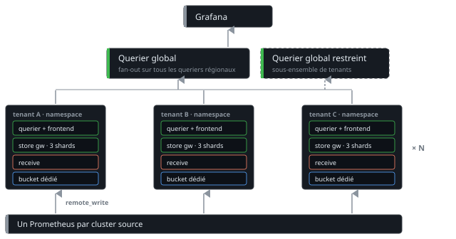
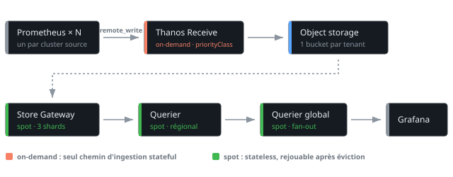
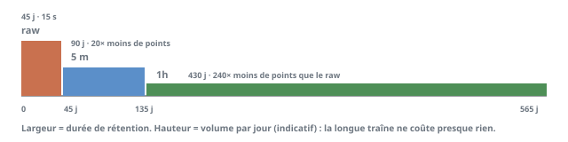
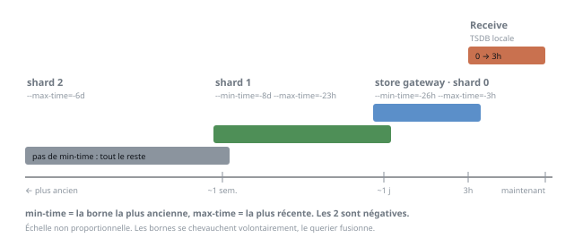

# Thanos at scale : archi, perf et FinOps

!!! warning "Écrit pour Thanos 0.42"
    Les flags et leurs valeurs par défaut bougent d'une version à l'autre, et certains sont
    dépréciés en silence, comme `--store.grpc.series-sample-limit` remplacé par
    `--store.limits.request-samples`. Vérifier contre la doc de sa propre version avant de
    copier quoi que ce soit, et ne rien lire ici comme un optimum : ce sont les arbitrages
    qu'on a faits avec nos contraintes, pas une configuration de référence.

Un Prometheus garde ses métriques aussi longtemps qu'on le lui demande. On pose
`--storage.tsdb.retention.time`, ou `--storage.tsdb.retention.size` si on préfère plafonner
en volume, et c'est réglé. La rétention n'a jamais été le problème.

Le problème est ailleurs. La TSDB vit sur un seul disque sans réplication, et elle grossit
linéairement parce que Prometheus ne downsample pas. Surtout, elle ne sait répondre que
pour elle-même alors qu'avec une vingtaine de clusters on veut une requête qui les traverse
toutes.

C'est pour ça qu'on met Thanos devant. La doc explique très bien les mécanismes, mais
personne n'écrit la facture, ni le fait que chaque décision est un arbitrage où on gagne
sur le coût pour payer ailleurs. Certaines de ces décisions, on a dû les annuler.

## Thanos, Mimir ou VictoriaMetrics

Premier malentendu à lever. On associe souvent Thanos au mode sidecar, donc à du pull, par opposition à Mimir qui serait du push. C'est faux dès qu'on utilise Thanos Receive : les Prometheus font un `remote_write`, exactement comme vers Mimir. Le chemin d'ingestion est le même, la config Alloy aussi (voir [Grafana Alloy](alloy.md), il suffit de changer l'URL).

Et le mode Receive apporte quelque chose que le sidecar ne peut pas donner : le filtrage à la source. Le sidecar uploade les blocks de la TSDB telle qu'elle est, donc tout ce qui est scrapé finit dans le bucket. Le seul filtre disponible est `metric_relabel_configs`, au scrape, qui supprime la métrique localement aussi. Avec `remote_write` on utilise `write_relabel_configs`, qui ne touche que ce qui part.

```yaml
remote_write:
  - url: http://thanos-receive:19291/api/v1/receive
    write_relabel_configs:
      # tout ce qui est utile en debug local mais pas sur 14 mois
      - source_labels: [__name__]
        regex: 'go_.*|process_.*|promhttp_.*'
        action: drop
      # les histogrammes de latence par endpoint, ingérables en cardinalité
      - source_labels: [__name__, handler]
        regex: 'http_request_duration_seconds_bucket;/api/v1/.*'
        action: drop
```

C'est le levier de coût le plus direct de toute la stack, parce qu'il agit avant l'ingestion : on ne paye ni le stockage, ni la compaction, ni la cardinalité de ce qu'on a laissé sur place. La rétention locale de Prometheus reste complète pour du debug à chaud, seule la longue traîne est filtrée.

Le vrai critère de choix est ailleurs : un stack isolé par tenant, ou un cluster mutualisé ?

- Mimir et VictoriaMetrics poussent vers un backend unique et multi-tenant, avec des limites par tenant
- Thanos Receive permet le multi-tenant, mais rien n'oblige à l'utiliser ainsi

On a pris le chemin inverse du manuel : un jeu complet de composants par cluster source. Chaque cluster a son bucket, son namespace, son receive, ses store gateways, son querier. Ça multiplie les composants, et c'est assumé.

Ce qu'on y gagne :

- le blast radius d'un tenant en surcharge s'arrête à son namespace
- le dimensionnement se fait par tenant, un petit cluster ne paye pas pour le gros
- pas de bruit de voisinage sur l'ingestion

Ce qu'on y perd : une vingtaine de compactors, de queriers et de store gateways à opérer. C'est tout le sujet de la suite.

## L'architecture high-level

Un stack complet par tenant, et au-dessus un querier global qui fait le fan-out sur tous les queriers régionaux.



Ce querier global pousse la parallélisation bien plus haut que les régionaux, avec son propre cache de résultats. Rien n'oblige à n'en avoir qu'un. On peut poser un second querier global sur un sous-ensemble de tenants, pour donner à une équipe une vue limitée à son périmètre sans lui ouvrir la flotte entière.

```yaml
query:
  extraFlags:
    - --query.auto-downsampling
    - --grpc-compression=snappy
queryFrontend:
  extraFlags:
    - --query-range.split-interval=12h
    - --labels.max-query-parallelism=256      # 50 en régional, 14 par défaut
    - --query-range.max-query-parallelism=256
    - --query-frontend.compress-responses
    - --cache-compression-type=snappy
    - --query-frontend.log-queries-longer-than=10s
```

Ce qui compte n'est pas dans les flags, c'est que la liste des stores à interroger est dérivée du même sélecteur de labels que le générateur des stacks, pas écrite en dur. Une liste statique dérive toujours. On finit avec une entrée qui pointe vers un Thanos mort, ou un tenant que personne n'interroge.

`--query-frontend.log-queries-longer-than=10s` est à activer dès le premier jour. C'est ce qui permet de savoir quel dashboard fait souffrir la stack, plutôt que de le deviner.

## Le chemin d'une métrique



La couleur porte l'essentiel : tout ce qui est stateless et rejouable tourne sur spot, seul le chemin d'ingestion reste on-demand.

## Éviter le trafic inter-zone

Chaque flèche du schéma précédent est du trafic facturé. Receive qui uploade ses blocks, la store gateway qui les retélécharge à chaque miss de cache, les séries qui remontent en gRPC vers le querier, puis le fan-out du querier global sur tous les régionaux. À une vingtaine de tenants le volume est conséquent, et personne ne le regarde parce qu'il n'apparaît pas sur la ligne compute.

Sur GCP, un transfert entre 2 zones d'une même région est facturé, alors qu'il est gratuit à l'intérieur d'une zone. On colle donc tous les composants d'un stack dans la même zone, au lieu de laisser le scheduler les répartir pour faire de la haute dispo.

Le bucket suit la même logique mais à la maille région, un bucket GCS étant régional et pas zonal. Depuis une VM de la même région la sortie ne coûte rien, alors qu'un bucket dans une autre région ou en multi-région se paye à chaque lecture, et la store gateway lit beaucoup.

!!! warning "Le prix : plus de redondance de zone"
    Un stack dans une seule zone tombe avec sa zone. C'est le même arbitrage que le RF=1 :
    on accepte de perdre un tenant le temps d'une panne zonale plutôt que de payer du trafic
    inter-zone en permanence. Sur des métriques la perte est bornée et l'historique reste
    dans le bucket, ce qui rend le compromis tenable là où il ne le serait pas sur une base
    transactionnelle.

C'est aussi ce qui rend le cache partagé et `--grpc-compression=snappy` rentables au-delà de la latence : ils réduisent des octets qui sont facturés.

La version de Thanos compte autant que la config. Le batching gRPC arrivé en 0.41 réutilise les labels qui se répètent d'une série à l'autre, ce qui fait tomber le trafic réseau de plus de 70 % et divise les allocations mémoire par 64 sur des fetchs de plusieurs millions de séries. Aucun tuning de config ne donne ça.

## Spot pour tout ce qui se rejoue

Un pod de querier évicté n'est pas important, la requête sera réessayée sur un autre pod. Une store gateway évictée retélécharge ses index-headers. Un compactor évicté reprendra son travail au run suivant. Tous ces composants sont sur un node pool spot dédié.

Receive, non. C'est le seul composant qui tient de la donnée pas encore uploadée. Il reste sur un pool on-demand, avec un `priorityClassName` dédié pour ne pas se faire évicter par la pression d'un autre workload.

```yaml
# Composants rejouables
tolerations:
  - key: kubernetes.io/arch
    value: arm64
    effect: NoSchedule
nodeSelector:
  cloud.google.com/compute-class: thanos-spot

---
# Receive : chemin d'ingestion stateful
nodeSelector:
  cloud.google.com/compute-class: thanos
priorityClassName: thanos-receive-critical
```

Le prix à payer se voit à la reprise. Une store gateway peut mettre jusqu'à **30 minutes** à redevenir prête après une éviction, le temps de retélécharger ses index-headers. Il faut caler les alertes dessus, sinon on se réveille la nuit pour rien.

```yaml
- alert: ThanosStoreIsDown
  expr: up{job=~".*thanos-store.*"} == 0
  for: 30m      # et pas 5m : la reprise après éviction spot est lente
```

Reste une question qu'on oublie de se poser : pendant ces 30 minutes, que voit l'utilisateur ? Ça dépend de `--query.partial-response`, activé par défaut. La query renvoie ce qu'elle a pu récupérer, assorti d'un warning, plutôt qu'une erreur. Un dashboard affiche donc un graphe avec un trou dedans, et le trou ne se voit pas forcément.

C'est le bon comportement pour du dashboard temps réel, beaucoup moins pour une règle d'alerting ou un rapport de capacité. Le paramètre se surcharge par requête, et une réponse partielle n'est jamais mise en cache.

Le tout tourne sur des instances ARM, ce qui se cumule avec le spot sur le ratio prix/performance. La tolération `arch=arm64` est posée sur tous les composants.

## Receive : le composant le plus cher

Receive garde la head de sa TSDB en mémoire, donc sa consommation ne suit pas le débit d'ingestion mais le **nombre de séries actives**. Doubler la fréquence de scrape ne change presque rien, ajouter un label à forte cardinalité fait exploser la facture, et comme c'est le seul composant en on-demand chaque Gio y coûte plus cher qu'ailleurs.

On ne plafonne pas cette RAM, on agit sur ce qui la fait grossir.

Le levier le moins cher reste de réduire le nombre de séries. Le `write_relabel_configs` vu plus haut agit avant l'ingestion donc il ne coûte rien, et le `head_series_limit` par tenant plafonne ensuite ce qu'un cluster peut pousser.

Vient ensuite le sharding du hashring. Avec l'algorithme Ketama les séries se répartissent sur plusieurs pods de Receive au lieu de se concentrer sur un seul, la RAM par pod baisse d'autant, et des gabarits plus petits sont plus faciles à placer.

Le plus structurant est de séparer le routing de l'ingestion. Quand `--receive.local-endpoint` n'est pas défini, un Receive tourne en mode routeur pur et transmet les écritures sans rien stocker localement. On peut alors poser beaucoup de routeurs légers devant peu d'ingesters, et ne payer de la RAM que sur ces derniers.

!!! warning "Ce qu'on n'active pas sans raison"
    Les caches de postings étendus (`--tsdb.head.expanded-postings-cache-size` et son
    équivalent block) sont expérimentaux et désactivés par défaut : les activer se paye
    directement en mémoire. Les exemplars aussi, `--tsdb.max-exemplars` valant 0, ce qui
    veut dire au passage que les exemplars envoyés en `remote_write` sont droppés en silence.

!!! warning "Le redémarrage est le moment dangereux"
    Au redémarrage, Receive rejoue son WAL en mémoire avant d'accepter du trafic. Si le pod
    OOM avant la fin, le WAL a grossi entre-temps et le replay suivant est plus lourd encore,
    ce qui transforme un simple restart en indisponibilité longue. Le signal à surveiller est
    le nombre de segments WAL et pas `up` : une croissance continue veut dire que la
    compaction ne suit plus.

Enfin, comme Receive est un binaire Go, il mérite un `GOMEMLIMIT` calé sur sa limite de pod. Sans ça le GC laisse la heap grossir jusqu'à l'OOM kill au lieu de s'emballer pour rester sous le seuil. Voir [GOMAXPROCS et GOMEMLIMIT dans Kubernetes](../../kubernetes/deployment/gomaxprocs_gomemlimit_kubernetes.md).

## Rétention et downsampling



3 paliers sur le compactor :

```yaml
compactor:
  retentionResolutionRaw: 45d
  retentionResolution5m: 90d
  retentionResolution1h: 430d
```

430 jours plutôt que 365, parce que comparer un pic saisonnier à celui de l'année d'avant demande un peu de marge, et 2 mois de plus ne coûtent presque rien à cette résolution.

Et c'est là que le downsampling devient intéressant : la longue traîne est quasi gratuite. Passer de 15 secondes à 1 heure, c'est 240 fois moins de points. Les 430 jours en résolution horaire pèsent une fraction des 45 jours en résolution native. Garder un an ne coûte pas 12 fois 2 mois.

!!! warning "Ne jamais gérer les blocks avec une lifecycle policy du bucket"
    Le compactor est le seul composant qui connaît les dépendances entre un block raw et ses
    versions downsamplées, donc lui seul peut décider quoi supprimer. Une politique de cycle
    de vie côté object storage supprime ou archive à l'aveugle.

Le retour d'expérience qui circule sur le sujet est instructif. Une équipe a basculé 6 mois de blocks vers une classe d'archivage pour économiser une cinquantaine de dollars mensuels de stockage. Le compactor a voulu compacter des blocks devenus illisibles sans restauration préalable, a échoué, et a retenté toutes les 5 minutes en boucle. Les requêtes objet sont passées de 1,1 million à 40 millions par jour, soit 13 dollars à 480 dollars sur la seule ligne API, et l'économie de stockage a été payée 10 fois.

Dans le même ordre d'idées, les paliers du compactor doivent rester alignés sur ce que les store gateways servent réellement, sinon on paye pour des blocks que personne n'interroge, ou on cherche de la donnée que la rétention a déjà supprimée.

Côté flags de compaction :

```yaml
extraFlags:
  - --deduplication.func=penalty
  - --deduplication.replica-label=prom_replica
  - --compact.enable-vertical-compaction
  - --block-files-concurrency=2
  - --compact.blocks-fetch-concurrency=1
  - --downsample.concurrency=1
  - --no-debug.halt-on-error
  - --wait-interval=2m
```

Un mot sur `--no-debug.halt-on-error` : le compactor sort en erreur au lieu de continuer en silence. On préfère un job rouge à un bucket qui se dégrade sans que personne ne le voie.

Ce garde-fou a une limite qu'il faut connaître. Le downsampling peut se terminer sur un warning du type `empty chunks happened, skip series` sans jamais passer en erreur, donc sans halte, et la rétention supprimera ensuite les blocks raw alors qu'aucun remplaçant downsamplé n'a été produit. Le halt ne couvre que les vraies erreurs, pas les succès assortis d'un warning, ce qui oblige à surveiller les logs du compactor et pas seulement ses codes de sortie.

Les 3 flags de concurrence sont à 1 ou 2 volontairement. Ils valent 1 par défaut, et la doc recommande d'allouer un cœur CPU par unité de `--compact.concurrency`. Les monter transforme un job court en job cher.

!!! warning "2 flags à ne pas activer à l'aveugle"
    `--deduplication.func=penalty` sert à dédupliquer des replicas Prometheus qui ne sont
    pas bit à bit identiques, mais l'algorithme casse encore occasionnellement les `rate` et
    `irate`. Quant à `--compact.enable-vertical-compaction`, il fusionne des flux de blocks :
    si 2 producteurs différents publient avec les **mêmes external labels**, leurs séries
    se mélangent et deviennent inexploitables. C'est pour ça que chaque tenant a son propre
    jeu d'external labels, et c'est non négociable.

## Compacter sans payer le disque 24h/24

C'est l'optimisation la plus rentable de la stack, et celle qui a le plus d'effets de bord.

Un compactor déployé en Deployment tourne 24h/24 avec son PVC attaché en permanence. Sauf qu'il ne travaille réellement que quelques minutes toutes les quelques heures. Sur une vingtaine de stacks, ça fait une vingtaine de disques facturés en continu pour un usage marginal.

On l'a donc passé en CronJob avec un volume éphémère :

```yaml
compactor:
  enabled: false        # on ne veut pas le Deployment du chart

# CronJob maison
schedule: "0 */6 * * *"
concurrencyPolicy: Forbid
successfulJobsHistoryLimit: 1
failedJobsHistoryLimit: 1
ttlSecondsAfterFinished: 600
persistence:
  ephemeral: true
  storageClass: hyperdisk-standard
```

Le `concurrencyPolicy: Forbid` n'est pas cosmétique. **2 compactors simultanés sur le même bucket corrompent les blocks.** C'est une garantie que le Deployment assurait tout seul et qu'il faut réclamer explicitement en CronJob.

Le volume éphémère est ce qui matérialise l'économie. Le disque est créé avec le Pod et réclamé à la fin du job. Plus de PVC en `Bound` entre 2 runs.

!!! warning "L'effet de bord : votre alerting ment"
    La règle standard `ThanosCompactIsDown` repose sur un `absent()` ou un `up == 0`. Entre 2 runs, il n'y a plus ni Pod, ni Service, ni cible de scrape. La règle passe donc en alerte **en permanence**, 23 heures sur 24.

Il faut la neutraliser et la remplacer par des règles qui interrogent l'état du CronJob via `kube-state-metrics` :

```yaml
# La règle générique ne peut pas matcher
- alert: ThanosCompactIsDown
  expr: vector(0) == 1

# Aucun run réussi depuis 12h, alors que le schedule est à 6h
- alert: ThanosCompactCronJobStale
  expr: |
    time() - kube_cronjob_status_last_successful_time{cronjob=~".*thanos-compact.*"} > 12 * 3600
  for: 30m

# Un job en échec
- alert: ThanosCompactCronJobFailed
  expr: kube_job_failed{job_name=~".*thanos-compact.*"} > 0
  for: 5m
```

La fenêtre de 12 heures tolère un cycle manqué. `ThanosCompactCronJobFailed` reste du best-effort. Le `ttlSecondsAfterFinished` à 600 fait disparaître le Job 10 minutes après son échec, donc la fenêtre de détection est courte.

Ces 2 règles disent si le job tourne, pas s'il fait son travail. Un compactor peut réussir tous ses runs, avoir `thanos_compact_halted` à 0, et laisser le backlog s'accumuler parce que la concurrency ne suit pas le volume produit. Le bucket grossit alors en continu sans que rien ne s'allume. Depuis la v0.24 il expose de quoi le voir venir.

```yaml
# Compactions planifiées qui ne sont jamais faites
- alert: ThanosCompactBacklog
  expr: sum(thanos_compact_todo_compactions) > 100
  for: 6h

# Blocks en attente de downsampling ou de suppression
- alert: ThanosCompactQueueGrowing
  expr: |
    sum(thanos_compact_todo_downsample_blocks) > 50
    or sum(thanos_compact_todo_deletion_blocks) > 100
  for: 6h
```

Le `by (group)` sur `thanos_compact_todo_compactions` est ce qui permet d'isoler le groupe de compaction qui traîne, plutôt que de constater que le total monte.

## Un shard par tranche de temps

Une store gateway qui sert tout le bucket doit être dimensionnée pour la requête la plus violente qu'on lui posera jamais, par exemple un dashboard avec un timerange de 6 mois qui va charger énormément de donnée en RAM sur tous les replicas, pendant que le dashboard temps réel attend derrière.

Or les 2 profils d'accès n'ont rien à voir :

- les données récentes sont interrogées en permanence, sur un petit volume, et doivent répondre vite
- les données anciennes sont interrogées rarement, mais chaque requête scanne énormément et supporte d'être lente

On a donc découpé la store gateway en 3 shards par plage de temps, avec 2 replicas chacun. Le plus récent démarre à 3 heures, parce qu'en dessous c'est Receive qui sert encore la donnée depuis sa TSDB.



Les 2 flags sont négatifs et se lisent à l'envers de ce qu'on croit. `--min-time` est la borne la plus ancienne, donc le nombre le plus grand en valeur absolue. `--max-time` est la plus récente.

```yaml
# shard 0 : de 3h à 1 jour, le chaud, sollicité en continu
- --min-time=-26h
  --max-time=-3h

# shard 1 : de 1 jour à 1 semaine
- --min-time=-8d
  --max-time=-23h

# shard 2 : tout ce qui est plus vieux qu'une semaine
- --max-time=-6d
```

Le découpage sert 2 choses.

Le dimensionnement suit le profil d'accès. Chaque shard est taillé pour son usage, donc sur les gros tenants le shard historique monte à plusieurs dizaines de Gio de RAM sans qu'on les donne aux 2 autres, alors que le shard chaud reste modeste. Sans découpage on paye le pire cas partout.

Le blast radius se réduit aussi, puisqu'une requête de 6 mois ne tape que le shard historique. Elle peut le saturer sans mettre par terre celui qui sert le dernier jour.

!!! warning "Faire chevaucher les plages, volontairement"
    Les bornes ci-dessus se recouvrent d'une heure ou d'un jour, et ce n'est pas une erreur.
    La doc Thanos recommande explicitement le chevauchement : le querier sait fusionner, et
    ça évite un trou si un shard est indisponible. À l'inverse, des bornes jointives au
    millimètre garantissent une fenêtre aveugle dès qu'un replica manque.

Le filtrage se fait au niveau du chunk et pas de l'échantillon, donc un shard peut renvoyer des points hors de sa plage annoncée. La découverte des blocks est aussi asynchrone, à l'intervalle de `--sync-block-duration` qui vaut 15 minutes par défaut, ce qui s'ajoute au délai d'upload.

Ce découpage temporel n'est pas le seul possible. Quand c'est le bucket d'un seul tenant qui devient trop gros, le sharding par labels externes via `--selector.relabel-config` répond mieux, et les 2 se combinent.

## Payer de la capacité disque pour acheter du débit

La store gateway tournait au départ sur `emptyDir`, donc sur le disque de boot du nœud. Sur les gabarits qu'on avait choisis, le téléchargement des index-headers au démarrage saturait ce disque : les instances sont IO bound, et un store qui doit rapatrier ses index-headers y passe un temps déraisonnable. Ce sont ces mêmes minutes qu'on retrouve dans les 30 minutes de reprise après éviction.

D'où un PVC dédié pour la store gateway, dimensionné pour le débit et non pour la place.

Sur les disques provisionnés de GCP, Hyperdisk en l'occurrence, le débit et les IOPS ne sont pas offerts avec la capacité : ils sont provisionnés, et **plafonnés à 500 IOPS par Gio**. Le plancher utilisable tourne autour de 3000 IOPS, ce qui impose au minimum 6 Gio rien que pour y avoir droit. On monte donc le volume d'index-header à 20 Gio alors qu'il ne contient pas 20 Gio de données : on achète des IOPS, la capacité vient avec.

C'est l'inverse du réflexe habituel, qui est de tailler au plus juste. Ici la capacité est bon marché comparée au débit provisionné, donc sur-dimensionner le disque est le moyen le moins cher d'avoir des performances.

!!! note "C'est un contournement, pas une optimisation"
    Tout ce calcul existe parce qu'on a choisi des instances économiques qui sont IO bound.
    Avec des gabarits plus généreux en débit disque, ou du local SSD, le problème ne se
    poserait pas et la store gateway n'aurait pas besoin de PVC du tout. On a déplacé le
    coût du compute vers le stockage, ce qui reste gagnant sur la facture, mais il faut
    savoir que la solution propre est ailleurs.

## Un seul cache chaud pour toute la flotte

Thanos a 3 caches, et par défaut ils sont tous les 3 en mémoire du process :

- l'index cache de la store gateway (`--index-cache.config`), qui garde les postings et les séries
- le caching bucket (`--store.caching-bucket.config`), qui garde les sous-plages de chunks et les métadonnées de blocks
- le cache de résultats du query frontend (`--query-range.response-cache-config`), qui garde les réponses de requêtes

En `IN-MEMORY`, chaque replica a le sien, personne ne partage rien et tout est perdu au premier redémarrage. À un stack par cluster ça se chiffre vite, puisque 3 shards et 2 replicas chacun sur une vingtaine de stacks font de l'ordre de la centaine de pods, chacun portant son 1 Gio d'index cache et ses 2 Gio de caching bucket. La store gateway finit autour de 230 Gio de RAM pour moins d'un cœur de CPU, ce qui dit assez qu'on paye du cache et pas du calcul.

Et c'est là que ça rejoint le choix du spot. Une éviction ne coûte rien en compute, c'est tout l'intérêt, mais avec un cache en mémoire elle coûte le cache. Le pod revient froid et repart pour de longues minutes avant d'être utile. Le cache local est ce qui rend le spot cher.

Un backend partagé règle les 2 problèmes d'un coup. Un seul cache chaud pour tous les replicas, qui survit aux évictions, et une seule enveloppe mémoire au lieu de 100.

### Memcached ou Redis

Memcached est plus simple à poser, mais il n'est pas horizontalement scalable en l'état : c'est au client de faire le sharding, et la haute dispo demande du travail. Redis coûte un peu plus cher en exploitation mais apporte Sentinel pour le failover et un vrai comportement en cluster.

La configuration est la même forme pour les 3 caches. Pour la store gateway :

```yaml
# --index-cache.config
type: REDIS
config:
  addr: "redis-sentinel.<namespace>.svc.cluster.local:26379"
  master_name: "thanos-cache"
  dial_timeout: 5s
  read_timeout: 3s
  write_timeout: 3s
  max_get_multi_concurrency: 100
  cache_size: 0
enabled_items: []
ttl: 24h
```

Et pour le query frontend, le même fichier se branche sur les 2 endpoints :

```yaml
args:
  - --query-range.response-cache-config-file=/etc/thanos/redis.yml
  - --labels.response-cache-config-file=/etc/thanos/redis.yml
```

!!! warning "Le piège du failover Sentinel"
    Après une bascule, les composants Thanos continuent de parler à l'ancien master, devenu
    replica, et on récolte des `can't write against a read only replica`. Il faut pointer
    Thanos sur le service Sentinel et renseigner `master_name`, pour que le client demande
    à Sentinel qui est le master courant au lieu de le supposer.

Sur Sentinel 6.2 et plus, activer aussi `sentinel resolve-hostnames yes`, sinon les IP des
replicas s'accumulent dans la liste des slaves.

Un mot sur `cache_size` : à une valeur non nulle, il active un cache côté client par-dessus le cache Redis. Utile quand les mêmes clés reviennent en boucle, ce qui est exactement le cas d'un dashboard rafraîchi toutes les 30 secondes.

### Le gain côté facture

Le listing du bucket est un poste à part. Chaque replica de store gateway découvre les nouveaux blocks de son côté, et 2 flags pilotent ce que ça coûte.

`--block-discovery-strategy` décide comment on liste. La stratégie `concurrent`, celle par défaut, lance un appel par répertoire et fait donc N+1 requêtes. La stratégie `recursive` itère sur tout le bucket : moins d'appels, mais une itération plus lente.

`--sync-block-duration` décide à quelle fréquence, 15 minutes par défaut. L'allonger divise mécaniquement le nombre d'appels, au prix d'un block qui devient interrogeable plus tard. C'est un compromis moins cher qu'il n'y paraît, parce que la donnée fraîche est servie par Receive et que le shard le plus récent de la store gateway ne démarre qu'à 3 heures.

Sur une centaine de pods qui listent chacun de leur côté, les 2 arbitrages valent d'être posés.

Les appels à l'object storage sont facturés à la requête, et le trafic sortant l'est au volume. Un cache partagé et chaud coupe les 2, et un replica qui redémarre ne repaye pas ce que ses voisins ont déjà téléchargé.

Le `--query-range.split-interval` joue dans le même sens, puisque découper une requête longue en tranches de 12h rend chaque tranche réutilisable, alors que sans découpage une plage un peu différente rate le cache en entier. C'est aussi pour ça que `--query-range.align-range-with-step` compte : aligner les bornes sur le pas fait retomber les requêtes sur les mêmes clés.

!!! tip "Ce qui n'est jamais mis en cache"
    Le query frontend refuse de cacher les requêtes avec `dedup=false`, celles qui portent
    des store matchers, celles en partial response, et toute réponse assortie d'un warning.
    Un dashboard qui coche une de ces cases ne bénéficiera jamais du cache, quelle que soit
    la taille qu'on lui donne.

## Mettre des limites en lecture et en ingestion

Logger les requêtes lentes ne suffit pas, il faut pouvoir les arrêter. Avec RF=1 et des store gateways sur spot, un seul dashboard qui balaie plusieurs mois de raw peut saturer une store qui mettra ensuite ses 30 minutes à revenir.

Côté lecture, les garde-fous sont sur la store gateway :

```yaml
extraFlags:
  - --store.limits.request-series=2000000
  - --store.limits.request-samples=100000000
  - --store.grpc.downloaded-bytes-limit=10GB
  - --store.grpc.series-max-concurrency=20
```

Les 2 premiers remplacent `--store.grpc.touched-series-limit` et `--store.grpc.series-sample-limit`, qui sont dépréciés. Tous valent 0 par défaut, c'est-à-dire aucune limite.

Côté ingestion c'est plus intéressant financièrement, parce que Receive est on-demand donc le plus cher au vCPU, et que rien ne le protège d'un tenant qui explose en cardinalité.

```yaml
# --receive.limits-config-file
write:
  default:
    request:
      size_bytes_limit: 0
      series_limit: 1000
      samples_limit: 10000
    head_series_limit: 1000000
  tenants:
    gros-tenant:
      head_series_limit: 5000000
```

!!! warning "head_series_limit n'est pas une barrière étanche"
    Il a besoin d'une meta-monitoring, c'est-à-dire d'un endpoint compatible Prometheus
    Query API que Receive interroge toutes les 15 secondes pour connaître le nombre de
    séries actives par tenant. Si cet endpoint est injoignable, Receive **arrête de limiter**
    et se contente de logger. La donnée étant par nature en retard, on dépasse toujours un
    peu la limite, et la fonctionnalité est marquée expérimentale.

Le dépassement se traduit par un HTTP 413 côté client. Prometheus ne sait pas découper une requête trop grosse pour la renvoyer, donc ce qui est refusé est perdu. Une limite trop basse ne ralentit pas un tenant, elle lui fait des trous dans ses métriques.

## Nos tests et nos échecs

Le PVC de la store gateway réglait le problème de disque saturé, mais pas la lenteur du téléchargement lui-même. L'étape suivante paraissait donc évidente : activer la stratégie de téléchargement paresseux, pour ne charger que ce dont on a besoin. Moins de disque, moins de trafic, un démarrage plus rapide.

On l'a **retirée**. Sur des dashboards historiques larges, ceux qui balaient plusieurs mois d'un coup, le p99 est monté jusqu'à environ **224 secondes**. L'économie de disque ne valait pas des dashboards inutilisables.

Ce qui reste activé, c'est uniquement la lecture paresseuse en mémoire :

```yaml
extraFlags:
  - --store.enable-index-header-lazy-reader
```

Toutes les optimisations de coût ne passent pas. Celle-là s'est payée en latence et on est revenus en arrière.

## Réplication : le choix assumé

Thanos Receive sait faire du hashring et de la réplication. L'infrastructure est déployée, le `receive-controller` tourne, la ConfigMap de hashring existe, le flag est câblé.

Il n'est activé nulle part. **Le facteur de réplication réel est de 1.**

La résilience ne repose donc pas sur la duplication de l'ingestion, mais sur 2 autres choses : la rétention locale de la TSDB (12 heures de head) et l'upload continu vers l'object storage. Si un receive tombe, on perd la fenêtre non uploadée de ce tenant, pas l'historique.

C'est un arbitrage coût contre disponibilité, pas un oubli. Un facteur de réplication supérieur à 1 multiplie la mémoire, puisque chaque replica maintient sa propre copie des séries en RAM, et on parle du composant qui est justement en on-demand. Le flag reste prêt pour basculer un tenant précis si son SLA le justifie.

Le raisonnement se retourne d'ailleurs, parce qu'avec RF=2 et au moins 2 replicas une éviction devient survivable, donc receive pourrait descendre sur spot comme le reste et on récupérerait l'économie sur le composant le plus cher. Ce qu'on paierait à la place, c'est une archi nettement plus complexe, avec le hashring à maintenir, le receive-controller qui le recalcule à chaque changement de topologie et les rééquilibrages qui vont avec. On a préféré payer de l'on-demand plutôt que de la complexité.

!!! note "À ne pas confondre avec la déduplication"
    Le `--deduplication.replica-label=prom_replica` vu plus haut n'a rien à voir. Il traite
    les paires de Prometheus en HA qui écrivent les mêmes séries en double vers Receive.
    La réplication interne de Receive, elle, est bien désactivée.

## Garder une vingtaine de stacks maintenables

Un stack par cluster, ça veut dire dupliquer la configuration autant de fois. La réponse tient en 2 mécanismes.

Un ApplicationSet ArgoCD génère les stacks à partir d'un sélecteur de labels sur le registre de clusters. Ajouter un cluster à la flotte ne demande aucune merge request sur Thanos : on pose le label sur le cluster, le stack apparaît.

Les values Helm sont empilées en couches, de la plus générique à la plus spécifique :

```text
values/common/            defaults partagés par tous les stacks
values/thanos-common/     defaults de l'archétype « stack régional »
values/thanos-<type>/     surcharge par type de bucket
values/thanos-<tenant>/   surcharge dédiée à un tenant
```

L'option qui rend le tout praticable est `ignoreMissingValueFiles: true` : chaque étage devient optionnel. On déclare les 4 couches partout, et seules celles qui existent s'appliquent.

Les versions récentes d'ArgoCD acceptent le glob dans `valueFiles`. Une couche découpée en 12 fichiers par composant tient alors en 1 ligne au lieu de 12 :

```yaml
helm:
  ignoreMissingValueFiles: true
  valueFiles:
    - $argocd/apps/thanos/values/common/*.yml
    - $argocd/apps/thanos/values/thanos-common/*.yml
```

!!! warning "Le glob s'expanse alphabétiquement"
    Sans conséquence à l'intérieur d'une couche quand les fichiers sont découpés par
    composant et ne se recouvrent pas, mais on garde **un wildcard par couche** et les
    couches restent ordonnées : c'est entre elles que la précédence compte, pas dedans.

## Voir aussi

- [Grafana Alloy](alloy.md) — la collecte en amont, le `remote_write` pointe vers Receive au lieu de Mimir
- [GKE Spot Nodes](../../cloud/gcloud/spot_nodes.md) — la même ligne de partage entre workloads évictables et critiques
- [Netdata, Prometheus et Grafana](simple_monitoring_stack.md) — la stack de départ, avant que la rétention devienne un problème
