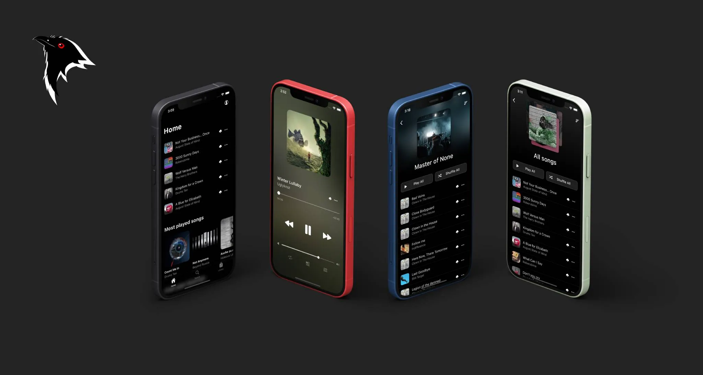

# Streamer sa musique depuis Koel



[Koel](https://koel.dev/) est un streamer musical self-hosted avec une interface proche de Spotify.
Support FLAC (transcodage FFmpeg), gestion de comptes, interface mobile. Activement maintenu (v6+).

## Docker (recommandé)

La méthode la plus simple. On crée un `docker-compose.yml` :

```yaml
services:
  koel:
    image: ghcr.io/koel/koel:latest
    ports:
      - "80:80"
    environment:
      DB_CONNECTION: mysql
      DB_HOST: db
      DB_PORT: 3306
      DB_DATABASE: koel
      DB_USERNAME: koel
      DB_PASSWORD: koelpassword
      APP_KEY: ""
      FORCE_HTTPS: "false"  # passer à true derrière un reverse proxy HTTPS
    volumes:
      - music:/music
      - storage:/var/www/html/public/img/storage
      - search_index:/var/www/html/storage/search-indexes
    depends_on:
      db:
        condition: service_healthy

  db:
    image: mysql:8
    environment:
      MYSQL_DATABASE: koel
      MYSQL_USER: koel
      MYSQL_PASSWORD: koelpassword
      MYSQL_ROOT_PASSWORD: rootpassword
    volumes:
      - mysql_data:/var/lib/mysql
    healthcheck:
      test: ["CMD", "mysqladmin", "ping", "-h", "localhost"]
      interval: 10s
      timeout: 5s
      retries: 5

volumes:
  music:
  storage:
  search_index:
  mysql_data:
```

On lance :

```bash
docker compose up -d
```

Au premier démarrage, Koel génère une `APP_KEY` automatiquement. On la récupère et on la fixe dans le compose :

```bash
docker compose logs koel | grep APP_KEY
```

L'interface est accessible sur `http://localhost`. Identifiants par défaut : `admin@koel.dev` / `KoelIsCool`.

## Installation manuelle

### Prérequis

- PHP 8.2+ avec les extensions : `BCMath`, `Ctype`, `Fileinfo`, `GD`, `JSON`, `Mbstring`, `OpenSSL`, `PDO`, `Tokenizer`, `XML`, `zip`, `curl`
- Node.js 18+ et pnpm
- Composer
- MySQL 8+ ou MariaDB 10.6+
- FFmpeg (optionnel, pour le transcodage FLAC)

```bash
apt install php8.2 php8.2-{bcmath,gd,mbstring,xml,zip,curl,mysql} \
    composer nodejs mysql-server ffmpeg
npm install -g pnpm
```

### Base de données

```sql
CREATE DATABASE koel DEFAULT CHARACTER SET utf8mb4 DEFAULT COLLATE utf8mb4_unicode_ci;
CREATE USER 'koel'@'localhost' IDENTIFIED BY 'koelpassword';
GRANT ALL PRIVILEGES ON koel.* TO 'koel'@'localhost';
FLUSH PRIVILEGES;
```

### Installation

```bash
git clone https://github.com/koel/koel.git /var/www/koel
cd /var/www/koel
composer install --no-dev
pnpm install
```

### Initialisation et configuration

`composer koel:init` gère tout en une commande : migrations, génération de clé, création du compte admin, et build des assets :

```bash
composer koel:init
```

Pour une install sans build des assets (archive pré-compilée) :

```bash
composer koel:init -- --no-assets
```

Le compte admin par défaut : `admin@koel.dev` / `KoelIsCool` — à changer immédiatement.

Les variables essentielles à vérifier dans `.env` après init :

```ini
DB_CONNECTION=mysql
DB_HOST=127.0.0.1
DB_DATABASE=koel
DB_USERNAME=koel
DB_PASSWORD=koelpassword

# Dossier contenant la musique
MEDIA_PATH=/var/www/koel/music

# Transcodage FLAC → MP3
FFMPEG_PATH=/usr/bin/ffmpeg
OUTPUT_BIT_RATE=256

# Optionnel : Last.fm
LASTFM_API_KEY=
LASTFM_API_SECRET=
```

### Droits

```bash
chown -R www-data:www-data /var/www/koel
chmod -R 755 /var/www/koel/storage
```

### Nginx

```nginx
server {
    listen 80;
    server_name music.example.com;
    return 301 https://$host$request_uri;
}

server {
    listen 443 ssl;
    server_name music.example.com;
    root /var/www/koel/public;

    ssl_certificate /etc/ssl/private/certificate.crt;
    ssl_certificate_key /etc/ssl/private/certificate.key;

    index index.php;

    location / {
        try_files $uri $uri/ /index.php?$query_string;
    }

    location ~ \.php$ {
        fastcgi_pass unix:/run/php/php8.2-fpm.sock;
        fastcgi_param SCRIPT_FILENAME $realpath_root$fastcgi_script_name;
        include fastcgi_params;
    }
}
```

## Synchronisation de la bibliothèque

En manuel ou pour forcer un re-scan :

```bash
php artisan koel:sync
```

En cron pour une sync automatique :

```bash
0 * * * * www-data cd /var/www/koel && php artisan koel:sync >/dev/null 2>&1
```

En Docker :

```bash
docker compose exec koel php artisan koel:sync
```
