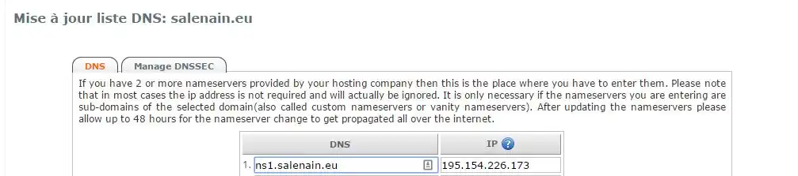

# Installer son NS ainsi que son resolveur DNS via BIND9

Pour se séparer au maximum des services tiers, on peut installer son propre [résolveur
DNS](https://www.bortzmeyer.org/son-propre-resolveur-dns.html) et paramétrer BIND9 comme serveur autoritaire.

## Comment fonctionne un NS

Un NS est un enregistrement DNS permettant d'avoir son propre serveur autoritaire.
Prenons l'exemple avec **wiki.jdelgado.fr** :

1. On interroge les ***root servers***, par exemple *g.root-servers.net*
2. Ce serveur indique le serveur à contacter — ici les serveurs autoritaires **du TLD .fr** : *x.dns.fr*
3. Ces serveurs indiquent quel serveur autoritaire **du nom de domaine**, dans notre cas **ns1.jdelgado.fr**
4. Et on obtient enfin l'IP du serveur.

Le serveur qu'on installe correspond à l'étape **3**.

## Comment fonctionne un résolveur DNS

Un *résolveur DNS* agit simplement : il résout n'importe quel nom de domaine et retourne son adresse IP.

L'intérêt d'avoir son propre résolveur DNS est d'éviter le *DNS Hijacking* (modification de la résolution DNS)
et l'espionnage du FAI.

Si on veut éviter le flicage sans monter son propre résolveur, il existe des projets comme
[OpenNIC](https://www.opennicproject.org/) qui liste le résolveur DNS libre le plus proche, ou
[DNS Watch](https://dns.watch/index) — résolveur libre IPv4/IPv6 sans log avec support DNSSEC.

## Installation

### Résolveur DNS

De base, BIND9 est correctement configuré pour résoudre les noms de domaine sur les interfaces locales :
`127.0.0.1`, `::1` et l'IP locale fournie par le DHCP.

```bash
apt install bind9
```

Pour vérifier que BIND9 est bien installé, `dig +short google.fr` doit retourner une IP Google.

Le dossier de configuration BIND9 contient 4 fichiers :

* `named.conf` — recense tous les fichiers de configuration
* `named.conf.default-zones` — zones par défaut
* `named.conf.local` — vide par défaut, c'est ici qu'on fait toutes les modifications
* `named.conf.options` — configuration de base avec toutes les options

Ne pas oublier d'éditer `/etc/resolv.conf` sous Linux pour utiliser le résolveur local.

### Serveur autoritaire

Un serveur autoritaire fait "autorité" sur une zone donnée et gère toutes les redirections (MX, A, CNAME...).

Généralement le registrar fait aussi serveur DNS, mais c'est souvent une usine à gaz — un simple BIND fait
l'affaire et est simple à mettre en œuvre.

Il faut d'abord mettre à jour la liste des NS chez le registrar :



Ici on indique que le serveur autoritaire sera `ns1.jdelgado.fr` soit `195.154.226.173`.

#### named.conf.local

On ajoute la zone à gérer par BIND9 :

```bash
zone "jdelgado.fr" IN {

        # Zone de type maître
        type master;

        # Fichier de zone
        file "/etc/bind/jdelgado.fr/db.jdelgado.fr";

        # On autorise le transfert de la zone aux serveurs DNS secondaires (Slaves)
        allow-transfer { 217.70.177.40; 213.186.33.199; 173.245.58.105; 173.245.59.150; 8.8.8.8; 8.8.4.4; };

        # On autorise tout le monde à envoyer des requêtes vers cette zone
        allow-query { any; };

        # Prévenir les serveurs DNS secondaires qu'un changement a été effectué dans la zone maître
        notify yes;

};
```

#### named.conf

On ajoute un include pour avoir des logs propres plutôt que tout dans syslog :

```bash
include "/etc/bind/named.conf.logging";
```

#### named.conf.logging

```bash
logging {
    channel security_file {
        file "/var/log/bind/security.log" versions 3 size 30m;
        severity dynamic;
    };

    channel b_query {
        file "/var/log/bind/query.log" versions 2 size 10m;
        severity info;
    };

    channel general_file {
        file "/var/log/bind/general.log" versions 3 size 5m;
        severity dynamic;
    };

    category queries { b_query; };
    category general { general_file; };
    category security { security_file; };
    category lame-servers { null; };
};
```

#### named.conf.options

```bash
acl allowQueried {
    188.166.95.206;
};

acl allowRecursion {
    localhost;
};
```
