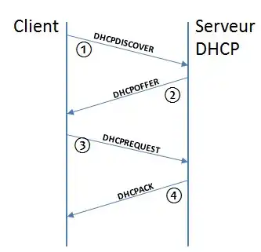

# Installer et configurer un serveur DHCP en PowerShell

Pour rappel, un serveur DHCP vous fournit une IP de manière automatique.
Il est possible d'exclure certaines IPs en faisant des leases
statiques...

Petit schéma pour vous rappeler comment fonctionne un serveur DHCP :



## Installation

Pour installer un serveur DHCP (et ses outils de management), une ligne
de PowerShell suffit :

```powershell
Install-WindowsFeature DHCP -IncludeManagementTools
```

Tout d'abord, il est important de rajouter l'utilisateur et le groupe
du serveur DHCP aux administrateurs locaux

```powershell
Add-DHCPServerSecurityGroup -ComputerName DHCPServer
```

Puis on restart le service

```powershell
Restart-Service dhcpserver
```

Une fois ceci fait, nous pouvons passer à la '"vraie'" configuration
(Pools d'IP, DNS...)

Maintenant, nous pouvons passer à la configuration

## Configuration

### Active Directory

Dans le cadre d'un AD, il y a quelques étapes préliminaires à faire
afin de l'intégrer à celui-ci

```powershell
Add-DhcpServerInDC -DnsName DHCPServer -IPAddress 1.1.1.1
```

Où DHCPServer est le nom de notre serveur et 1.1.1.1 son IP

```powershell
Set-DHCPServerDnsCredential -ComputerName "DHCPServer"
```

Cette ligne nous perment de définir des identifiants afin de pouvoir
enregistrer ou supprimer des entrées DNS sur notre serveur DNS local
pour un ADDS

### Pool d'IP

```powershell
Add-DHCPServerv4Scope -EndRange 10.1.1.254 -Name LAN1 -StartRange 10.1.1.1 -SubnetMask 255.255.255.0 -State Active
```

### Exclusion IP

```powershell
Add-DHCPServerV4ExclusionRange -ScopeId 10.1.1.0 -StartRange 10.1.1.70 -EndRange 10.1.1.75
```

### Gateway, DNS

```powershell
Set-DHCPServerv4OptionValue -ComputerName DHCPServer.test.com -DnsServer 10.1.1.2 -DnsDomain test.com -Router 10.1.1.1
```

**Autre manière :**

```powershell
Set-DhcpServerv4OptionDefinition -OptionId 3 -DefaultValue 10.1.1.1
```

```powershell
Set-DhcpServerv4OptionDefinition -OptionId 6 -DefaultValue 10.1.1.2
```

```powershell
Set-DhcpServerv4OptionDefinition -OptionId 15 -DefaultValue test.com
```

Les options sont les suivantes **OptionID**

* 3 : Gateway
* 6 : DNS
* 15 : Domain

### Réservation IP

Il peut-être pratique (par exemple dans le cas de serveurs) de faire une
réservation d'IP avec un bail extrêmement long. Deux manières de
procéder existe :

* Soit l'ajout manuel IP par IP (Ici, on va fixer l'adresse IP
    10.10.10.8 qui se trouve dans le range 10.10.10.0 ayant l'adresse
    mac F0-DE-F1-7A-00-5E

```powershell
Add-DhcpServerv4Reservation -ScopeId 10.10.10.0 -IPAddress 10.10.10.8 -ClientId F0-DE-F1-7A-00-5E -Description "Reservation for Printer"
```

* Soit par l'instanciation d'un CSV comportant toutes les entrées à
    fixer :

```csv
ScopeId,IPAddress,Name,ClientId,Description
10.10.10.0,10.10.10.10,Computer1,1a-1b-1c-1d-1e-1f,Reserved for Computer1
20.20.20.0,20.20.20.11,Computer2,2a-2b-2c-2d-2e-2f,Reserved for Computer2
30.30.30.0,30.30.30.12,Computer3,3a-3b-3c-3d-3e-3f,Reserved for Computer3
```

```powershell
Import-Csv –Path Reservations.csv | Add-DhcpServerv4Reservation -ComputerName dhcpserver.contoso.com
```

## Vérification

Vérifier l'état du pool :

```powershell
Get-DhcpServerv4Scope
```

Désactiver le pool

```powershell
Set-DhcpServerv4Scope -ComputerName DHCPServer -ScopeId 10.1.1.0 -State InActive
```

Activer le pool

```powershell
Set-DhcpServerv4Scope -ComputerName DHCPServer -ScopeId 10.1.1.0 -State Active
```

Exporter la configuration du serveur DHCP

```powershell
Export-DHCPServer -ComputerName DHCPServer -File C:'dhcp'dhcp.xml
```

* `-Lease` pour inclure les baux

## Problème de failover

Lorsque nous ajoutons une réservation DHCP, celle-ci n'est pas
dupliquée automatiquement entre les 2 serveurs du Failover, il faut donc
faire la commande manuellement :

```powershell
Invoke–DhcpServerv4FailoverReplication –ComputerName dhcpserver.contoso.com
```
